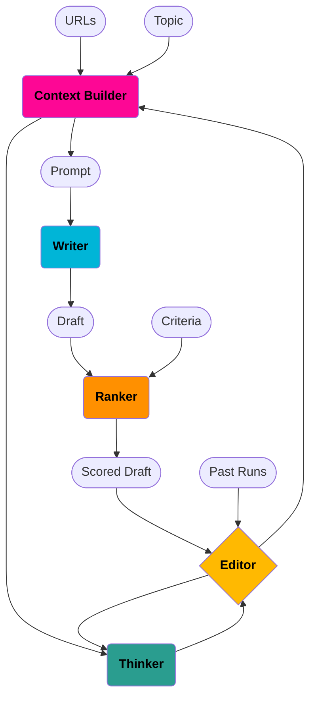

# AIWriter: AI-Powered Essay Writing and Improvement Tool

AIWriter is an intelligent writing assistant that leverages AI to write, evaluate, and iteratively improve essays and articles. Using an agent-based approach, it takes a prompt and relevant context, then refines drafts until they meet quality criteria.

## Features

- **Autonomous Essay Improvement**: Writes and refines drafts until they meet quality standards
- **Context Builder**: Fetches and parses content from URLs to use as reference material
- **Multi-criteria Evaluation**: Scores essays on clarity, conciseness, relevance, engagement, and accuracy
- **Insight Generator**: Analyzes drafts and suggests specific improvements
- **Customizable Output**: Control essay length, style, and target audience

## Installation

```bash
pip install aiwriter
```

## Quick Start

```bash
# Set your API key
export ANTHROPIC_API_KEY="sk-ant-..." # the default model is anthropic's
# if using an openai model, use OPENAI_API_KEY, if using another provider, use "<PROVIDER_NAME>_API_KEY"

# Run the agent loop to write and iteratively improve an essay
aiwriter editor "Write an article about climate change solutions"
```

## Core Commands

```bash
# Full agent loop - writes and iteratively improves essay
aiwriter editor "Write an article about renewable energy" --length 1500

# Single essay generation without iteration
aiwriter write "Write a poem about the ocean" --style poetic --audience "children"

# Score an existing essay
aiwriter rank "$(cat my_essay.txt)"

# Extract insights from an essay
aiwriter think "$(cat my_essay.txt)"

# Build context from a list of URLs
aiwriter build < urls.txt > context.md

# Show detailed help
aiwriter help
```

## Using Context from URLs

You can provide a list of URLs to be used as source material for your essay:

```bash
# Create a file with URLs (one per line)
echo "
https://example.com/article1
https://example.com/article2
https://example.com/article3
" > context.txt

# Run with this context
aiwriter editor "Summarize the key points from these articles"
```

## Customizing the Criteria

By default, essays are scored on clarity, conciseness, relevance, engagement, and accuracy. You can customize this:

```bash
# Create a custom criteria file
echo "clarity,innovation,technical_depth,practical_application" > criteria.txt

# Set the environment variable
export AIWRITER_CRITERIA="criteria.txt"

# Run with custom criteria
aiwriter editor "Write a technical deep-dive on machine learning"
```

## Configuration

### Environment Variables

| Variable | Description | Default |
|----------|-------------|--------|
| `ANTHROPIC_API_KEY` | API key for Anthropic | *(required)* |
| `AIWRITER_MODEL` | AI model to use | `anthropic/claude-sonnet-4-20250514` |
| `AIWRITER_CONTEXT_FILE` | Input file with URLs | `context.txt` |
| `AIWRITER_CONTEXT_FULL_FILE` | Output file for parsed context | `full_context.txt` |
| `AIWRITER_CRITERIA` | Criteria file path | `criteria.txt` |
| `AIWRITER_DRAFTS_DIR` | Directory for draft outputs | `drafts/` |

## How It Works

AIWriter uses a multi-agent system to progressively improve essays:

1. **Context Builder**: Parses URLs and builds initial context
2. **Writer**: Generates an essay based on the prompt and context
3. **Ranker**: Evaluates the essay against multiple criteria
4. **Thinker**: Analyzes the essay and provides insights for improvement 
5. **Editor**: Orchestrates the entire process, managing iterations

### Architecture



## License

GPL 3.0