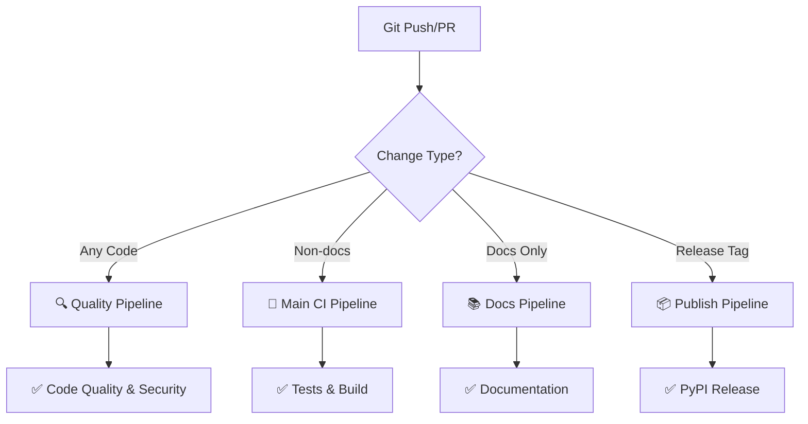

# CI/CD Pipeline Guide

datason uses a **modern, multi-pipeline CI/CD architecture** designed for speed, clarity, and parallel execution. This guide explains our complete CI/CD setup.

## 🏗️ **Architecture Overview**



## 🔄 **Pipeline Details**

### **🧪 Main CI Pipeline** (`ci.yml`)

**Triggers:**
- Push to `main`, `develop`
- Pull requests to `main`
- **Excludes**: docs-only changes

**What it does:**
```yaml
jobs:
  test:
    - 📥 Checkout code
    - 🐍 Setup Python 3.11
    - 💾 Cache pip dependencies
    - 📦 Install dev dependencies
    - 🧪 Run core tests (coverage)
    - 📊 Upload coverage to Codecov
    - 🔒 Security scan (bandit)
    - 📤 Upload security report

  build:
    - 🏗️ Build package (wheel + sdist)
    - ✅ Check package integrity
    - 📤 Upload build artifacts
```

**Performance:** ~2-3 minutes with caching

### **🔍 Code Quality & Security Pipeline** (`ruff.yml`)

**Triggers:**
- **All** pushes to `main`, `develop`
- **All** pull requests to `main`, `develop`

**What it does:**
```yaml
jobs:
  quality-and-security:
    - 📥 Checkout code
    - 🐍 Setup Python 3.11
    - 💾 Cache pip dependencies (quality)
    - 🛠️ Install ruff + bandit
    - 🧹 Run ruff linter
    - 🎨 Run ruff formatter check
    - 🛡️ Run bandit security scan
    - 📊 Generate quality report
```

**Performance:** ~30-60 seconds (15-30s with cache)

### **📚 Documentation Pipeline** (`docs.yml`)

**Triggers:**
- Changes to `docs/**`, `mkdocs.yml`, `README.md`

**What it does:**
```yaml
jobs:
  build-docs:
    - 📥 Checkout code
    - 🐍 Setup Python 3.11
    - 💾 Cache pip dependencies (docs)
    - 💾 Cache MkDocs build
    - 📦 Install docs dependencies
    - 🏗️ Build documentation
    - 📤 Upload docs artifact

  deploy-github-pages:
    - 🚀 Deploy to GitHub Pages (main only)
```

**Performance:** ~1-2 minutes (very fast with cache)

### **📦 Publish Pipeline** (`publish.yml`)

**Triggers:**
- GitHub releases (automatic)
- Manual workflow dispatch

**What it does:**
```yaml
jobs:
  build:
    - 🏗️ Build package
    - ✅ Verify package integrity
    - 📤 Upload build artifacts

  test-pypi:
    - 🧪 Publish to TestPyPI
    - ✅ Verify upload

  pypi:
    - 🚀 Publish to PyPI (releases only)
    - 📢 Create release summary
```

**Performance:** ~2-3 minutes

## ⚡ **Performance Optimizations**

### **Intelligent Caching Strategy**

Each pipeline has optimized caching:

```yaml
# Main CI - General development cache
key: ${{ runner.os }}-pip-${{ hashFiles('**/pyproject.toml') }}

# Quality - Specialized for linting tools
key: ${{ runner.os }}-quality-pip-${{ hashFiles('**/pyproject.toml') }}

# Docs - Documentation-specific cache + MkDocs
key: ${{ runner.os }}-docs-pip-${{ hashFiles('**/pyproject.toml') }}
key: ${{ runner.os }}-mkdocs-${{ hashFiles('mkdocs.yml') }}-${{ hashFiles('docs/**') }}
```

**Cache Benefits:**
- **First run:** Full dependency installation
- **Subsequent runs:** 2-5x faster execution
- **Cross-pipeline sharing:** Quality cache falls back to main cache

### **Smart Triggering**

**Path-based triggers** prevent unnecessary runs:

```yaml
# Main CI skips docs-only changes
paths-ignore:
  - 'docs/**'
  - '*.md'
  - 'mkdocs.yml'

# Docs pipeline only runs for docs changes
paths: ['docs/**', 'mkdocs.yml', 'README.md']
```

**Result:** Docs changes don't trigger expensive test runs

## 🎯 **Pipeline Responsibilities**

| Pipeline | Purpose | Speed | When |
|----------|---------|-------|------|
| **Main CI** | Core functionality validation | ~2-3 min | Code changes |
| **Quality** | Code quality & security | ~30-60s | All changes |
| **Docs** | Documentation generation | ~1-2 min | Docs changes |
| **Publish** | Package distribution | ~2-3 min | Releases |

## 🔍 **Quality Gates**

### **Automatic Checks**

Every commit is validated by:

```yaml
✅ Ruff linting (1000+ rules)
✅ Ruff formatting (consistent style)
✅ Bandit security scanning
✅ Test suite with coverage
✅ Type checking (mypy)
✅ Package build integrity
```

### **Required Checks**

For PR merging, these must pass:
- [ ] **Code Quality & Security** pipeline
- [ ] **Main CI** pipeline (if code changed)
- [ ] **Documentation** pipeline (if docs changed)

### **Optional Checks**

Non-blocking but monitored:
- Coverage reports (Codecov)
- Security reports (GitHub Security tab)
- Performance benchmarks

## 📊 **Monitoring & Reports**

### **GitHub Actions Dashboard**
- ✅ **Green**: All checks passing
- ❌ **Red**: Issues found, PR blocked
- 🟡 **Yellow**: In progress

### **Detailed Reports**

**Quality Pipeline** generates rich reports:
```yaml
## Code Quality & Security Report

### 🔍 Ruff Linting
✅ No issues found

### 🎨 Code Formatting  
✅ All files properly formatted

### 🛡️ Security Scan Results
**Scanned**: 2,547 lines of code
**High Severity**: 0
**Medium Severity**: 0  
**Low Severity**: 1
✅ **Security Status**: PASSED
```

### **Artifacts Available**

- 📊 **Coverage reports** (HTML, XML)
- 🛡️ **Security reports** (JSON)
- 📦 **Build artifacts** (wheels, sdist)
- 📚 **Documentation** (static site)

## 🚀 **Developer Workflow**

### **Local Development**
```bash
# Pre-commit handles local quality
git commit → pre-commit runs → quality checks pass → commit succeeds

# Manual quality check
ruff check --fix .
ruff format .
pytest --cov=datason
```

### **Push to GitHub**
```bash
git push origin feature-branch
```

**What happens:**
1. **Quality Pipeline** runs immediately (~30s)
2. **Main CI** runs in parallel (~2-3min)
3. **PR Status Checks** update in real-time

### **Documentation Changes**
```bash
# Edit docs/something.md
git push origin docs-update
```

**What happens:**
1. **Docs Pipeline** runs (~1-2min)
2. **Quality Pipeline** runs (for any .md files)
3. **Main CI** skipped (docs-only change)

### **Release Process**
```bash
# Create GitHub release
git tag v1.0.0
git push origin v1.0.0
# Create release in GitHub UI
```

**What happens:**
1. **Publish Pipeline** triggers automatically
2. **Package built** and verified
3. **Published to PyPI** with OIDC (secure, no tokens)

## 🛠️ **Configuration Files**

### **Workflow Locations**
```
.github/workflows/
├── ci.yml              # Main CI pipeline
├── ruff.yml            # Code quality & security
├── docs.yml            # Documentation
└── publish.yml         # PyPI publishing
```

### **Key Configuration**
```yaml
# pyproject.toml - Tool configuration
[tool.ruff]           # Linting rules
[tool.pytest]         # Test configuration  
[tool.coverage]       # Coverage requirements
[tool.bandit]         # Security scanning

# .pre-commit-config.yaml - Local hooks
repos:
  - ruff              # Local quality checks
  - bandit            # Local security
```

## 🔧 **Customization**

### **Adding New Checks**

**To Quality Pipeline:**
```yaml
- name: New Quality Check
  run: |
    new-tool check datason/
```

**To Main CI:**
```yaml
- name: New Test Type
  run: |
    pytest tests/test_new_feature.py
```

### **Performance Tuning**

**Cache Optimization:**
```yaml
# Add new cache for expensive tool
- name: Cache expensive-tool
  uses: actions/cache@v4
  with:
    path: ~/.cache/expensive-tool
    key: ${{ runner.os }}-expensive-${{ hashFiles('config') }}
```

**Parallel Jobs:**
```yaml
strategy:
  matrix:
    python-version: [3.8, 3.9, 3.10, 3.11, 3.12]
```

## 🎯 **Best Practices**

### **Pipeline Design**
- ✅ **Fast feedback** - Quality checks run first (30s)
- ✅ **Parallel execution** - Independent pipelines don't block each other
- ✅ **Intelligent triggers** - Only run what's needed
- ✅ **Comprehensive caching** - 2-5x speedup on repeated runs

### **Security**
- ✅ **OIDC Publishing** - No API tokens needed
- ✅ **Multi-tool scanning** - Bandit + Safety + pip-audit
- ✅ **Artifact signing** - GPG-signed commits
- ✅ **Dependency monitoring** - Dependabot + security advisories

### **Developer Experience**
- ✅ **Clear status** - GitHub status checks show exactly what failed
- ✅ **Rich reports** - Detailed summaries in GitHub UI
- ✅ **Local consistency** - pre-commit matches CI exactly
- ✅ **Fast iteration** - Quick feedback for common issues

## 📈 **Metrics & Performance**

### **Pipeline Performance**
| Pipeline | Cached | Uncached | Frequency |
|----------|--------|----------|-----------|
| Quality | ~30s | ~60s | Every push/PR |
| Main CI | ~2min | ~3min | Most pushes/PRs |
| Docs | ~1min | ~2min | Docs changes only |
| Publish | ~3min | ~3min | Releases only |

### **Success Rates**
- **Quality Pipeline**: 95%+ pass rate (fast feedback catches most issues)
- **Main CI**: 90%+ pass rate (comprehensive testing)
- **Docs**: 99%+ pass rate (simple build process)

## 🔍 **Troubleshooting**

### **Common Issues**

**Quality Pipeline Fails:**
```bash
# Local fix
ruff check --fix .
ruff format .
git commit --amend
```

**Main CI Test Failures:**
```bash
# Local debugging
pytest tests/test_failing.py -v
pytest --cov=datason --cov-report=html
# Open htmlcov/index.html
```

**Cache Issues:**
```bash
# Clear cache via GitHub Actions UI
# Or update cache key in workflow
```

### **Performance Issues**

**Slow Pipeline:**
- Check cache hit rates in Actions logs
- Verify cache keys are stable
- Consider splitting large jobs

**Resource Limits:**
- Use `timeout-minutes` for runaway processes
- Monitor memory usage in logs
- Consider matrix builds for heavy testing

---

**This architecture provides:**
- 🚀 **Fast feedback** (30s for quality issues)
- 🔄 **Parallel execution** (quality + tests simultaneously)  
- 💾 **Intelligent caching** (2-5x speedup)
- 🎯 **Smart triggering** (only run what's needed)
- 📊 **Rich reporting** (detailed GitHub summaries)
- 🔒 **Strong security** (multi-tool scanning + OIDC)

The result is a **production-ready CI/CD pipeline** that scales with your team while maintaining developer velocity! 🎉
