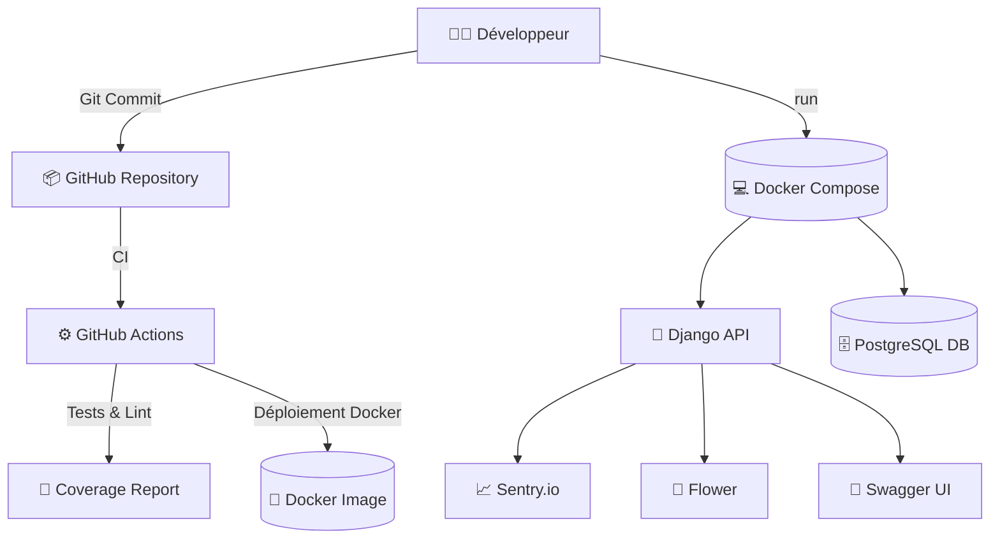

# $PROJECT_NAME

# Backend Django REST Framework pour le projet $PROJECT_NAME.
## Architecture : Clean Architecture, Domain Driven Design, Hexagonal.

## 🧱 Architecture

Suivi des principes Clean Architecture + DDD + Design Patterns :
- Séparation des responsabilités  
- DTOs pour transport des données  
- Use cases métier clairs  
- Services pour l'orchestration  
- Repositories pour accès BDD

### Développement typique d'une fonctionnalité :
1. Créer un fichier dans \`core/use_cases/\`
2. Définir un DTO dans \`dtos/\`
3. Définir interface repository
4. Implémenter repository (ORM)
5. Ajouter un service dans \`services/\`
6. Créer les vues + serializers
7. Mapper les routes dans \`api/v1/urls/\`
8. Ajouter les tests dans \`tests/\`

## 🧱 Architecture du projet (Clean Architecture + DDD + Design Patterns)

Ce module suit une architecture inspirée des principes de la **Clean Architecture**, du **Domain-Driven Design (DDD)** et des **Design Patterns** classiques pour Django.

### 🔁 Flux de développement typique

Voici la procédure recommandée pour développer une fonctionnalité (ex : "Créer une course") :

1. **Définir le besoin métier**  
   - Exprimer le cas d'utilisation métier dans un fichier dans \`core/use_cases/\` (ex : \`create_ride.py\`).  
   - Créer les entités nécessaires dans \`models/\` et éventuellement \`core/entities/\`.

2. **Créer le DTO (Data Transfer Object)** dans \`dtos/\`  
   - Sert à valider et transporter les données d’entrée et/ou de sortie.  
   - Exemple : \`ride_dto.py\` avec \`CreateRideDTO\`.

3. **Définir l'interface du Repository** dans \`repositories/interfaces/\`  
   - Exemple : \`ride_repository.py\` contenant \`create_ride(ride: Ride) -> Ride\`.

4. **Implémenter le Repository** dans \`repositories/implementations/\`  
   - Utilise Django ORM ou autre pour interagir avec la base.

5. **Créer le Service Métier** dans \`services/\`  
   - Coordonne les règles métier à travers les use cases et repositories.  
   - Exemple : \`ride_service.py\` avec \`create_ride_use_case(dto: CreateRideDTO)\`.

6. **Créer la Vue DRF/API** dans \`api/v1/views/\`  
   - Utilise le Service ou le Use Case pour exposer les données.  
   - Retourne des données sérialisées (via \`serializers/\`) aux clients.

7. **Créer le Serializer** dans \`api/v1/serializers/\`  
   - Mappe les données d'entrée/sortie à des structures Django REST Framework.

8. **Définir les URLs** dans \`api/v1/urls/\`  
   - Branche les vues sur des endpoints REST.

9. **Créer les Tests**  
   - \`tests/unit/\` pour les tests unitaires des services, use cases, etc.  
   - \`tests/integration/\` pour les tests de bout-en-bout des endpoints.

### 📦 Résumé de l’architecture

| Dossier                          | Rôle |
|----------------------------------|------|
| \`core/use_cases/\`             | Cas d’usage (logique métier déclarative) |
| \`core/exceptions/\`            | Exceptions personnalisées métier |
| \`core/types/\`                 | Types ou constantes du domaine |
| \`dtos/\`                       | Objets de transfert (entrée/sortie) |
| \`models/\`                     | Entités Django (structure DB) |
| \`services/\`                   | Orchestrateurs métier (appel des use cases/repos) |
| \`repositories/interfaces/\`    | Interfaces d’accès à la base |
| \`repositories/implementations/\` | Implémentations concrètes (ORM, APIs) |
| \`validators/\`                 | Règles de validation métier |
| \`infrastructure/\`             | APIs externes, Firebase, etc. |
| \`api/v1/views/\`               | Vues REST (DRF) |
| \`api/v1/serializers/\`         | DRF Serializers |
| \`api/v1/urls/\`                | Routes REST |
| \`api/v1/access_policy/\`       | Permissions DRF |
| \`helpers/\`                    | Fonctions utilitaires |
| \`signals/\`                    | Hooks de signaux Django |
| \`tests/unit/\`                 | Tests unitaires |
| \`tests/integration/\`          | Tests d’intégration |
| \`admin/\`                      | Configuration Django admin |

---

## ⚙️ Commande startcleanapp

Utilisez :

```bash
python manage.py startcleanapp nom_de_lapp
```

Cette commande :
- Crée l'application avec `startapp`
- Génère tous les dossiers Clean Architecture (api/v1, core, dtos, services, tests, etc.)
- Modifie automatiquement `apps.py`
- Ajoute l'app à `INSTALLED_APPS` dans settings.py ✅


## ⚙️ Fonctionnalités DevOps & Qualité de code

Ce projet intègre plusieurs outils pour faciliter le développement, la qualité, le test et le déploiement.

### 🐳 Docker + PostgreSQL

Le projet est prêt à être exécuté dans des conteneurs Docker avec une base PostgreSQL :

```bash
docker-compose up --build
```

Fichiers associés :
- `docker/Dockerfile` : Image backend Django
- `docker/docker-compose.yml` : Conteneur PostgreSQL + Django web

### 📝 Makefile

Simplifie l’exécution des commandes courantes :

```bash
make run          # Lance le serveur
make migrate      # Applique les migrations
make test         # Lance les tests avec couverture
make startclean   # Crée une app Clean Architecture
make flower       # Lance l’interface Celery Flower
```

### ✅ Pre-commit Hooks

Empêche les erreurs de code au moment des commits :

- `black` : Formatage automatique du code
- `flake8` : Vérification des bonnes pratiques

Initialisation automatique via :

```bash
pre-commit install
```

Fichier de config : `.pre-commit-config.yaml`

### 🧪 Couverture de tests (Coverage)

Mesure de la qualité des tests :

```bash
make test
```

Rapport affiché dans le terminal.

### 🔁 Watchdog

Surveillance automatique des fichiers pour relancer le serveur ou les tests à chaud (à personnaliser selon ton usage).

### 🧩 Swagger / OpenAPI via drf-spectacular

Génère automatiquement une documentation propre des API :

- Swagger UI : `/api/schema/swagger-ui/`
- ReDoc : `/api/schema/redoc/`

Exemple de config DRF :

```python
REST_FRAMEWORK = {
    "DEFAULT_SCHEMA_CLASS": "drf_spectacular.openapi.AutoSchema",
}
```

### 📈 Monitoring avec Sentry

Envoie automatiquement les erreurs non gérées à un tableau de bord :

- Ajoute ta clé DSN Sentry dans `.env` :  
  `SENTRY_DSN=https://xxx.ingest.sentry.io/123456`

```python
import sentry_sdk
from sentry_sdk.integrations.django import DjangoIntegration

sentry_sdk.init(
    dsn=os.getenv("SENTRY_DSN"),
    integrations=[DjangoIntegration()],
    traces_sample_rate=1.0,
    send_default_pii=True
)
```

### 🌼 Flower (Interface Celery)

Visualise les tâches Celery en cours :

```bash
make flower
```

Accès via : [http://localhost:5555](http://localhost:5555)

### 🔄 CI GitHub Actions

Chaque push déclenche une pipeline de test automatique avec PostgreSQL :

Fichier : `.github/workflows/ci.yml`

---

## 🔍 Schéma de l’écosystème DevOps

