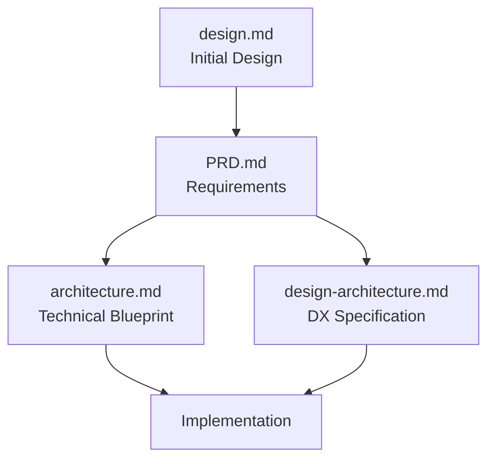

# Fabric MCP Server Documentation Index

This index provides an overview of the original key documentation files for the Fabric MCP Server project, which integrates Daniel Miessler's Fabric AI framework with the Model Context Protocol (MCP).

## Core Documentation Files

### [Product Requirements Document (PRD)](PRD.md)

**Purpose:** Defines the foundational requirements and scope for the Fabric MCP Server project.

**Key Contents:**

- Project goals and objectives
- Functional requirements for MVP (6 core MCP tools)
- Non-functional requirements (performance, security, reliability)
- User interaction and design goals
- Technical assumptions and constraints
- Epic breakdown with detailed user stories
- Testing requirements

**Target Audience:** Product managers, developers, stakeholders

---

### [Architecture Document](architecture.md)

**Purpose:** Provides the comprehensive technical blueprint for the Fabric MCP Server implementation.

**Key Contents:**

- High-level system overview and architectural patterns
- Component architecture and interactions
- Detailed project structure
- API specifications (both consumed and provided)
- Data models and schemas
- Core workflow sequence diagrams
- Technology stack decisions
- Error handling and security strategies
- Coding standards and testing approach

**Target Audience:** Software architects, developers, AI agents implementing the system

---

### [Developer Experience (DX) / Interaction Specification](design-architecture.md)

**Purpose:** Defines the user experience goals and interaction patterns for developers using the Fabric MCP Server.

**Key Contents:**

- Target user personas (MCP Client Developers, Server Operators, End Users)
- CLI command structure and design
- MCP tool organization and discoverability
- Detailed user flows for common scenarios
- Interaction patterns and conventions
- Language, tone, and terminology guidelines
- Accessibility requirements

**Target Audience:** UX designers, developers, technical writers

---

### [High-Level Design Document](design.md)

**Purpose:** Provides an initial design overview for integrating Fabric with MCP.

**Key Contents:**

- Background research on Fabric REST API and MCP
- Proposed MCP integration architecture
- Initial MCP tool definitions
- Implementation approach
- Benefits and next steps

**Target Audience:** Technical leads, developers new to the project

---

## Document Relationships

## Quick Reference

| Document | Focus Area | Key Decisions |
|----------|------------|---------------|
| PRD.md | What to build | 6 MCP tools, streaming support, 3 transport modes |
| architecture.md | How to build | Python 3.11+, FastMCP, httpx, monolithic service |
| design-architecture.md | User experience | CLI with click, MCP Inspector integration, clear error handling |
| design.md | Initial concept | REST API integration, no Fabric code changes |

## Getting Started

1. **New to the project?** Start with [design.md](design.md) for context
2. **Understanding requirements?** Read the [PRD](PRD.md)
3. **Implementing features?** Refer to [architecture.md](architecture.md)
4. **Building CLI or tools?** Check [design-architecture.md](design-architecture.md)

## Version Information

All documents include change logs tracking their evolution. The current versions represent the MVP scope for the Fabric MCP Server, focusing on core pattern execution, discovery, and configuration capabilities through a standardized MCP interface.
