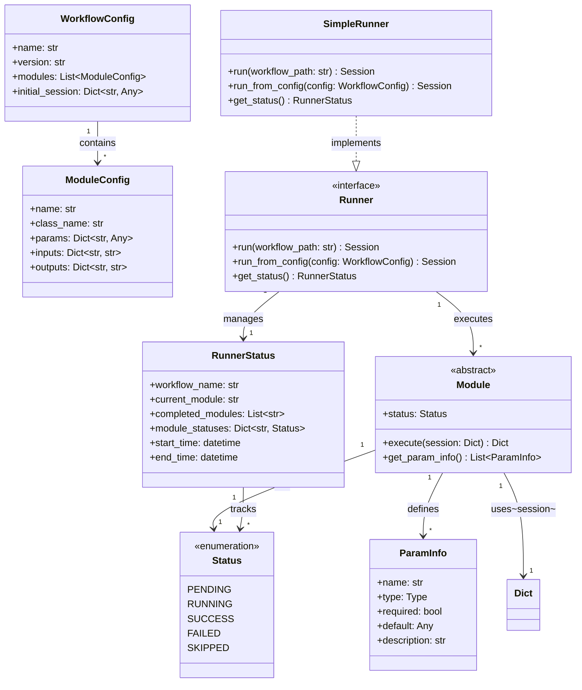
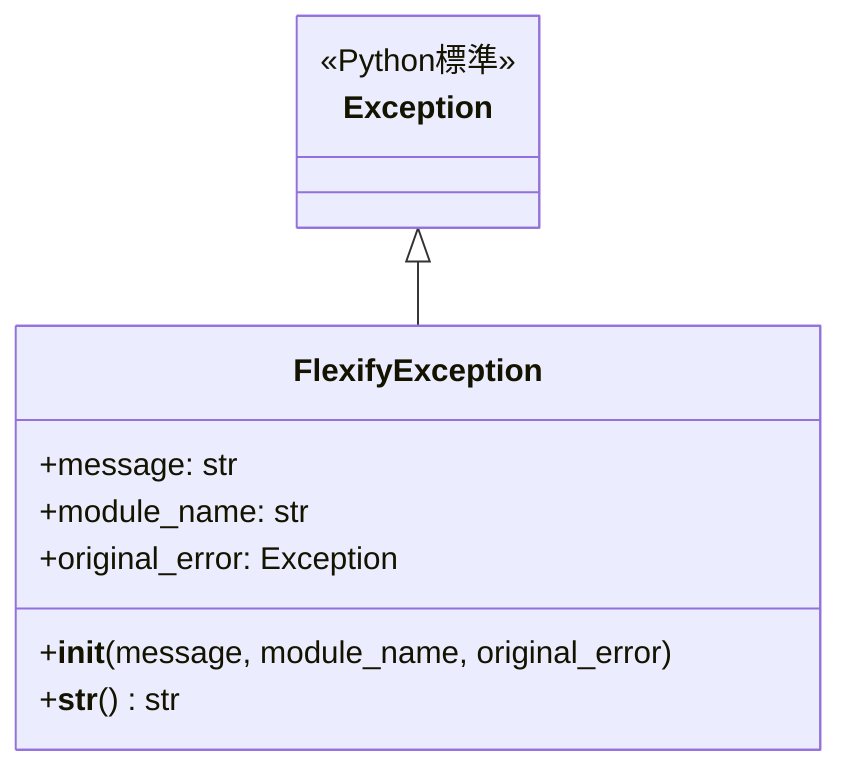
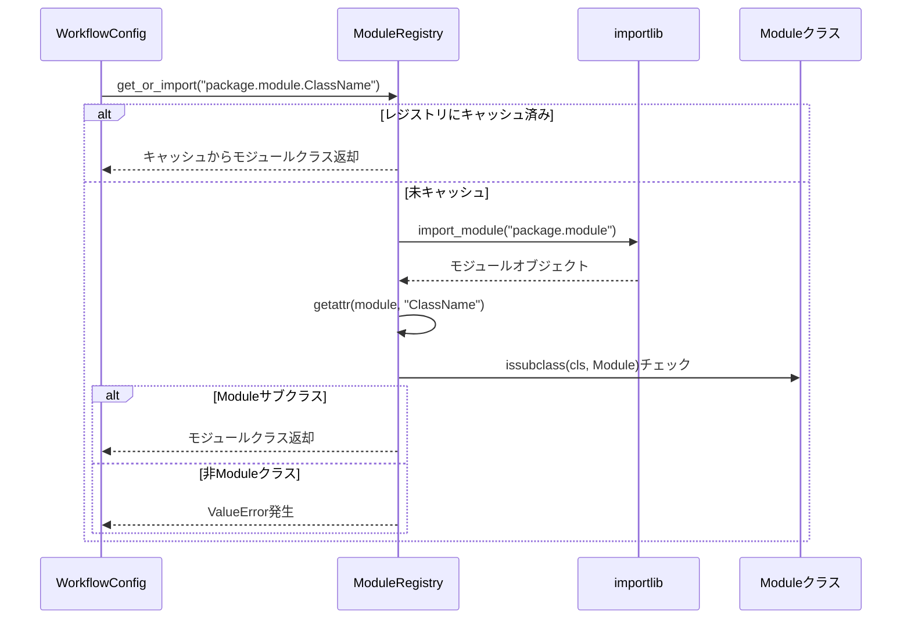

# アーキテクチャ設計書

## システム構成・アーキテクチャの概要

Flexifyは、クリーンアーキテクチャの原則に基づいたレイヤー構造を採用します。各レイヤーは明確な責務を持ち、依存関係は内側（ドメイン層）に向かって単一方向となります。

### レイヤー構造

```mermaid
graph TB
    subgraph "プレゼンテーション層"
        API[Web API<br/>将来実装]
        CLI[CLIインターフェース]
    end
    
    subgraph "アプリケーション層"
        Runner[Runnerインターフェース]
        SimpleRunner[SimpleRunner]
        Registry[ModuleRegistry]
    end
    
    subgraph "ドメイン層"
        Module[Module抽象クラス]
        ParamInfo[ParamInfoクラス]
        Session[Sessionデータ]
        Status[Statusクラス]
    end
    
    subgraph "インフラストラクチャ層"
        YAMLParser[YAMLParser]
        JSONParser[JSONParser]
        FileGateway[FileGateway]
        WorkflowParser[WorkflowParser<br/>インターフェース]
    end
    
    API --> Runner
    CLI --> Runner
    Runner --> Module
    Runner --> Registry
    SimpleRunner -.実装.-> Runner
    Registry --> Module
    Module --> ParamInfo
    Module --> Session
    Module --> Status
    Runner --> WorkflowParser
    WorkflowParser <|.. YAMLParser
    WorkflowParser <|.. JSONParser
    YAMLParser --> FileGateway
    JSONParser --> FileGateway
```

### 各レイヤーの責務

| レイヤー | 責務 | 主要コンポーネント |
|---|---|---|
| プレゼンテーション層 | ユーザーインターフェースの提供、入出力の制御 | CLI、Web API（将来） |
| アプリケーション層 | ユースケースの実装、ワークフローの制御 | Runner、ModuleRegistry |
| ドメイン層 | ビジネスロジックの実装、データモデルの定義 | Module、ParamInfo、Session、Status |
| インフラストラクチャ層 | 外部リソースへのアクセス、データの永続化 | YAMLParser、JSONParser、FileGateway |

## 主要インターフェース

| クラス名 | ファイルパス | 責務 | レイヤー |
|---|---|---|---|
| Module | `src/flexify/core/module.py` | 実行可能なモジュールの抽象基底クラス | ドメイン層 |
| ParamInfo | `src/flexify/core/param_info.py` | モジュールのパラメータ情報を保持するデータクラス | ドメイン層 |
| Status | `src/flexify/core/status.py` | モジュールの実行状態を表すEnumクラス | ドメイン層 |
| FlexifyException | `src/flexify/core/exceptions.py` | モジュール実行時のエラーを表す例外クラス | ドメイン層 |
| Runner | `src/flexify/runner/runner.py` | ワークフロー実行のインターフェース | アプリケーション層 |
| SimpleRunner | `src/flexify/runner/simple_runner.py` | Runnerの基本実装 | アプリケーション層 |
| ModuleRegistry | `src/flexify/registry/module_registry.py` | モジュールの検索・登録を管理 | アプリケーション層 |
| WorkflowParser | `src/flexify/parser/workflow_parser.py` | ワークフロー定義の解析インターフェース | インフラストラクチャ層 |
| YAMLParser | `src/flexify/parser/yaml_parser.py` | YAML形式のワークフロー解析 | インフラストラクチャ層 |
| JSONParser | `src/flexify/parser/json_parser.py` | JSON形式のワークフロー解析 | インフラストラクチャ層 |
| FileGateway | `src/flexify/gateway/file_gateway.py` | ファイルシステムへのアクセス | インフラストラクチャ層 |

## 主要データ（データの種類、構造）

| クラス名 | 保持するデータ | 用途 |
|---|---|---|
| Session | `Dict[str, Any]` - キーと値のペア（単純な辞書型） | モジュール間でのデータ共有 |
| ParamInfo | `name: str` - パラメータ名<br/>`type: Type` - パラメータの型<br/>`required: bool` - 必須フラグ<br/>`default: Any` - デフォルト値<br/>`description: str` - 説明 | パラメータの検証と文書化 |
| ModuleConfig | `name: str` - モジュール名<br/>`class_name: str` - クラス名<br/>`params: Dict[str, Any]` - パラメータ<br/>`inputs: Dict[str, str]` - 入力マッピング<br/>`outputs: Dict[str, str]` - 出力マッピング | ワークフロー内のモジュール設定 |
| WorkflowConfig | `name: str` - ワークフロー名<br/>`version: str` - バージョン<br/>`modules: List[ModuleConfig]` - モジュールリスト<br/>`initial_session: Dict[str, Any]` - 初期セッション | ワークフロー全体の設定 |
| RunnerStatus | `workflow_name: str` - ワークフロー名<br/>`current_module: str` - 現在のモジュール<br/>`completed_modules: List[str]` - 完了モジュール<br/>`module_statuses: Dict[str, Status]` - 各モジュールの状態<br/>`start_time: datetime` - 開始時刻<br/>`end_time: Optional[datetime]` - 終了時刻 | 実行状態の管理 |

### データモデル図（ER図）



## 設計方針

1. **単一責務の原則**: 各クラスは一つの明確な責務を持つ
2. **依存性逆転の原則**: 上位レイヤーは下位レイヤーに依存しない
3. **インターフェース分離**: 必要最小限のインターフェースを定義
4. **拡張性**: 新しいモジュールやパーサーを簡単に追加可能
5. **テスタビリティ**: 各コンポーネントが独立してテスト可能

## エラーハンドリング設計

### FlexifyException例外階層



### エラー伝播フロー

1. **モジュールレベル**: `Module.safe_execute()` でエラーをキャッチし、FlexifyExceptionでラップ
2. **ランナーレベル**: `SimpleRunner._execute_module()` でFlexifyExceptionを再送出または新規作成
3. **ワークフローレベル**: `SimpleRunner.run_from_config()` で最終的なエラーハンドリング

### エラー情報の保持

| レベル | 保持される情報 | 用途 |
|---|---|---|
| FlexifyException.message | エラーの詳細メッセージ | ユーザーへの通知 |
| FlexifyException.module_name | 失敗したモジュール名 | デバッグ・ログ |
| FlexifyException.original_error | 元の例外オブジェクト | 詳細なスタックトレース |
| RunnerStatus.module_statuses | 各モジュールの実行状態 | 進捗確認・障害分析 |

## モジュール検出とロード機構

### 動的モジュールロード



### モジュール登録方式

| 方式 | 実装状況 | 使用方法 |
|---|---|---|
| 動的インポート | ✅ 実装済み | ワークフローファイルで完全クラスパス指定 |
| 手動登録 | ✅ 実装済み | `registry.register(name, module_class)` |
| 自動検出 | ❌ 未実装 | 将来実装予定：パッケージスキャン |