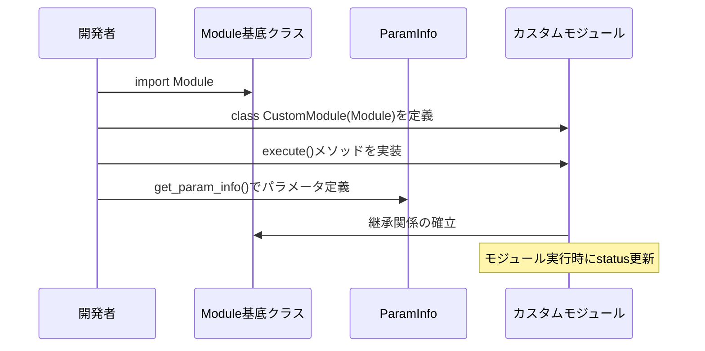
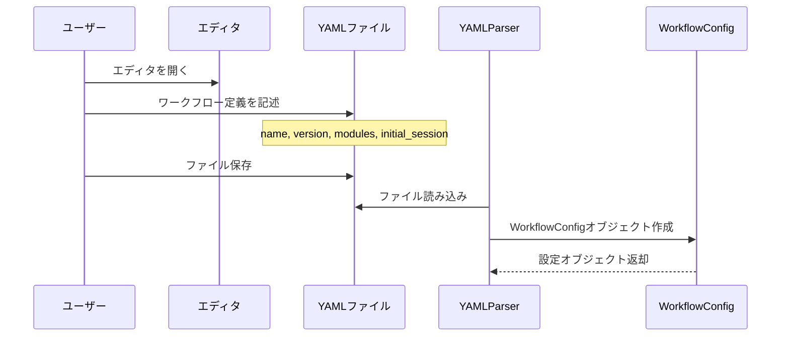
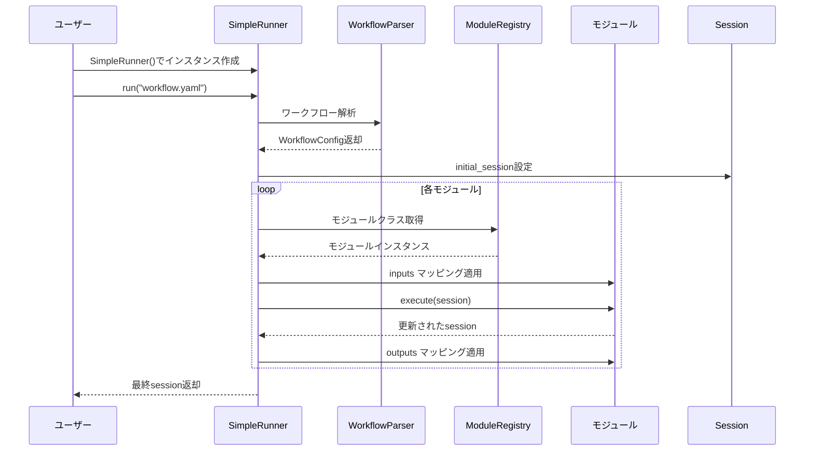
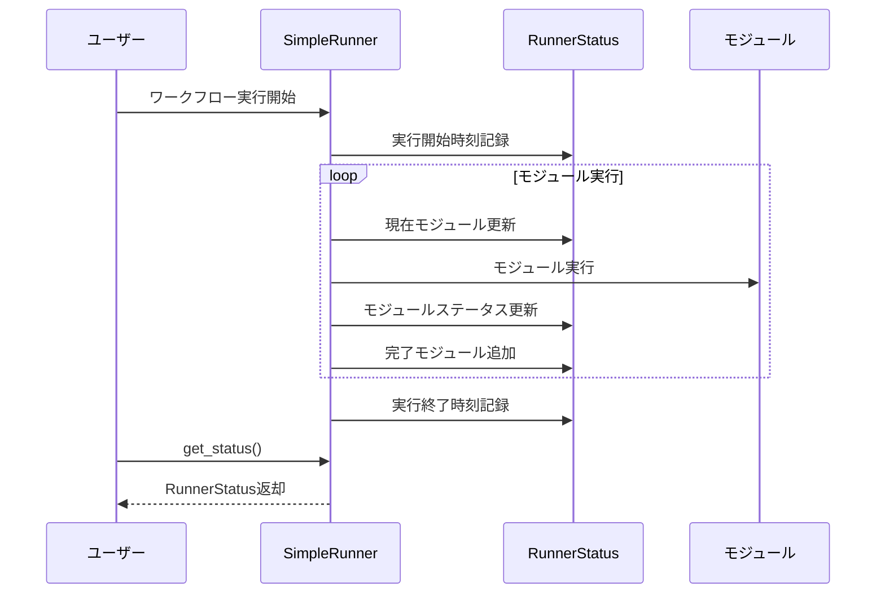
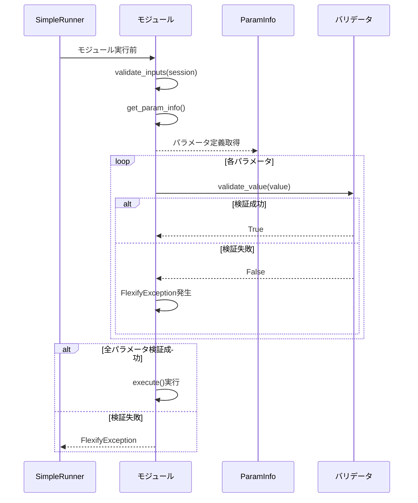
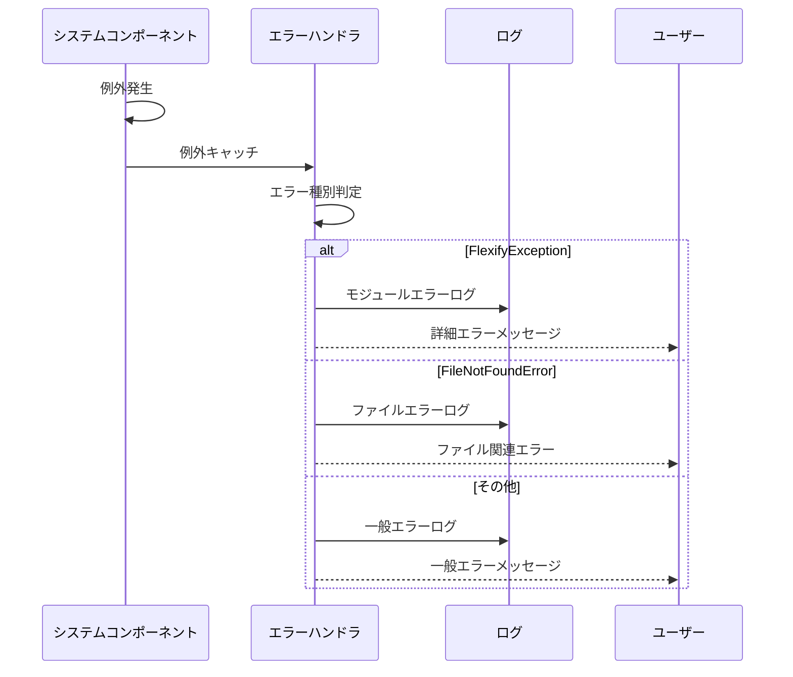
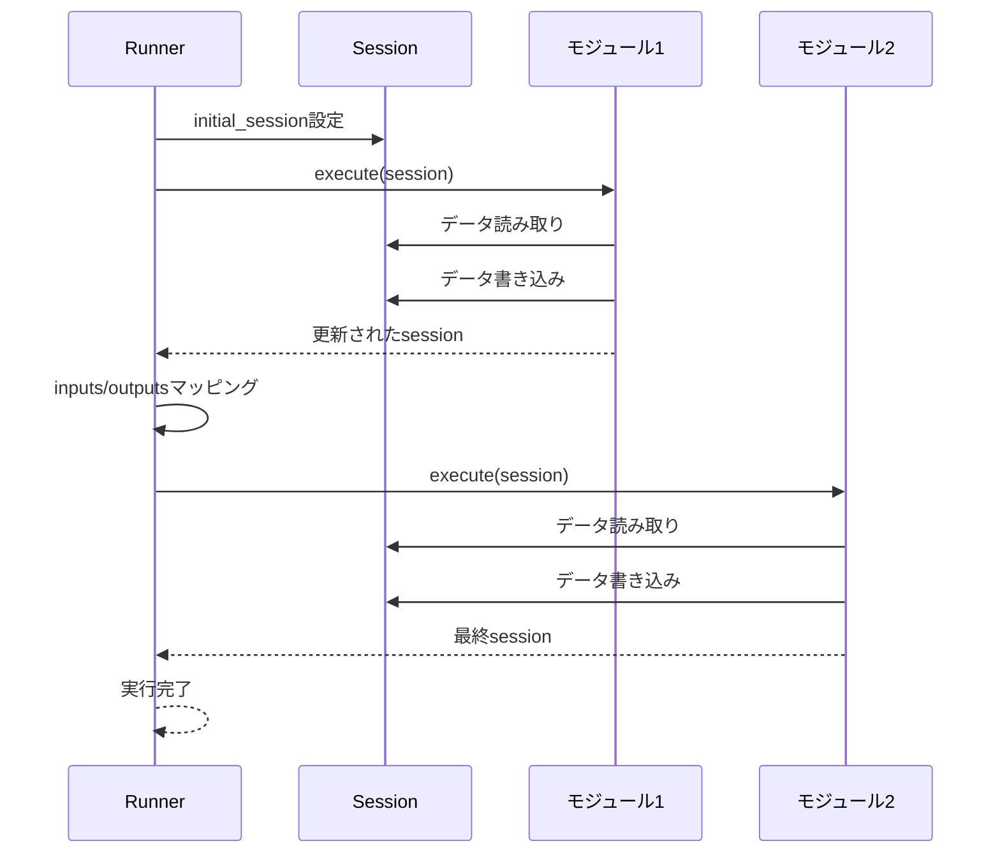
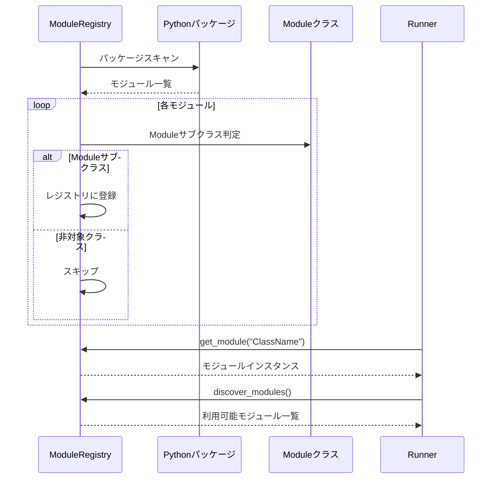
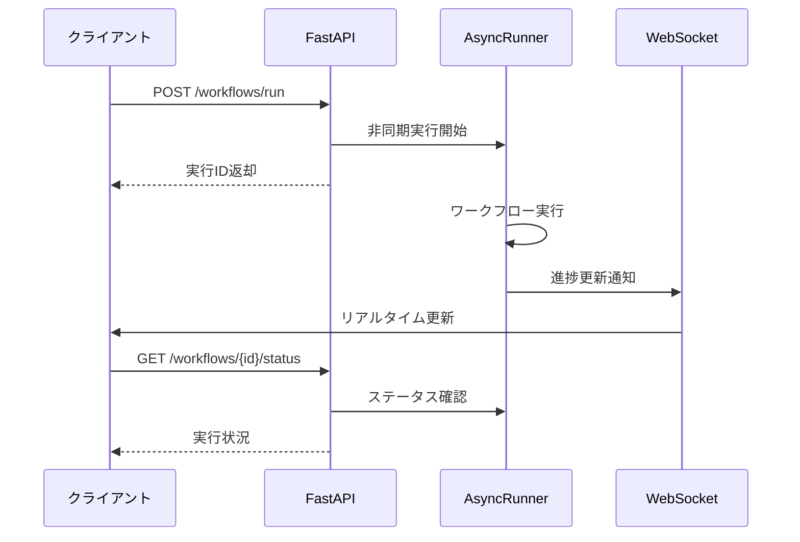
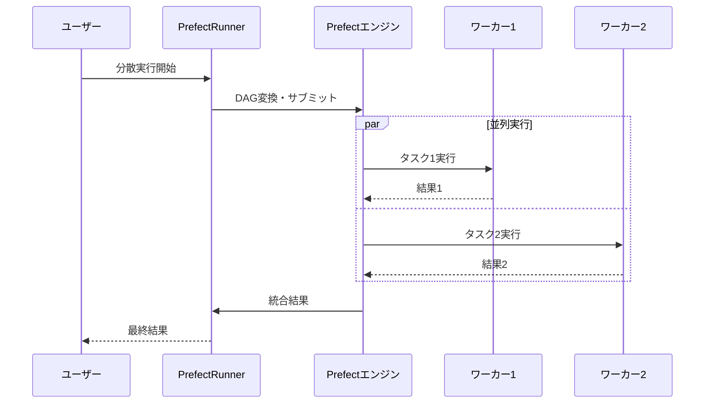

# 機能仕様書

## 概要

本文書は、要件定義書で定義された各機能の詳細仕様を記述します。各機能について、ユースケース手順とユースケースフローを明確化し、実装時の指針を提供します。

## 機能01: モジュール定義

### ユースケース手順

1. 開発者がModuleクラスをimportする
2. Moduleクラスを継承してカスタムクラスを定義する
3. execute()メソッドを実装してビジネスロジックを記述する
4. get_param_info()クラスメソッドでパラメータ情報を定義する
5. 必要に応じてstatus属性を更新する

### ユースケースフロー図



### 実装詳細

- **ファイル**: `src/flexify/core/module.py`
- **主要メソッド**:
  - `execute(session: Dict[str, Any]) -> Dict[str, Any]`: 抽象メソッド
  - `get_param_info() -> List[ParamInfo]`: クラスメソッド
  - `validate_inputs(session: Dict[str, Any]) -> bool`: 入力検証

## 機能02: ワークフロー定義

### ユースケース手順

1. ユーザーがYAMLまたはJSONエディタを開く
2. ワークフロー名とバージョンを定義する
3. modulesセクションでモジュール実行順序を記述する
4. 各モジュールのname、class_name、paramsを設定する
5. 必要に応じてinputs/outputsマッピングを定義する
6. initial_sessionで初期データを設定する
7. ファイルを保存する

### ユースケースフロー図



### 実装詳細

- **ファイル**: `src/flexify/parser/yaml_parser.py`, `src/flexify/parser/json_parser.py`
- **データ構造**: `WorkflowConfig`, `ModuleConfig`
- **サポート形式**: YAML 1.2、JSON

## 機能03: ワークフロー実行

### ユースケース手順

1. ユーザーがSimpleRunnerインスタンスを作成する
2. run()メソッドでワークフローファイルパスを指定する
3. RunnerがWorkflowConfigを解析する
4. initial_sessionを初期化する
5. モジュールを順番に実行する
6. 各モジュールでinputs/outputsマッピングを適用する
7. 最終sessionを返却する

### ユースケースフロー図



### 実装詳細

- **ファイル**: `src/flexify/runner/simple_runner.py`
- **主要メソッド**:
  - `run(workflow_path: str) -> Dict[str, Any]`
  - `run_from_config(config: WorkflowConfig) -> Dict[str, Any]`
  - `_execute_module(module: Module, config: ModuleConfig, session: Dict) -> Dict`

## 機能04: 進捗状況確認

### ユースケース手順

1. ユーザーがワークフロー実行を開始する
2. 実行中または完了後にrunner.get_status()を呼び出す
3. RunnerStatusオブジェクトで現在状況を確認する
4. 必要に応じて進捗情報をログ出力する

### ユースケースフロー図



### 実装詳細

- **ファイル**: `src/flexify/runner/data_models.py`
- **データクラス**: `RunnerStatus`
- **追跡項目**: 現在モジュール、完了モジュール、各モジュールステータス、実行時間

## 機能05: パラメータ検証

### ユースケース手順

1. モジュール実行前にvalidate_inputs()が自動呼び出しされる
2. get_param_info()からパラメータ定義を取得する
3. 各パラメータについてvalidate_value()で検証する
4. 必須パラメータの存在チェックを行う
5. 型チェックと必要に応じて型変換を実行する
6. 検証失敗時はFlexifyExceptionを発生する

### ユースケースフロー図



### 実装詳細

- **ファイル**: `src/flexify/core/param_info.py`, `src/flexify/core/module.py`
- **検証機能**: 型チェック、必須チェック、数値変換（int↔float）
- **エラー処理**: 詳細なエラーメッセージ付きFlexifyException

## 機能06: エラーハンドリング

### ユースケース手順

1. システム内で例外が発生する
2. 例外の種類に応じて適切なエラーメッセージを生成する
3. FlexifyExceptionまたは標準例外として上位に伝播する
4. エラー情報をログ出力する
5. 実行を停止し、適切な終了処理を行う

### ユースケースフロー図



### 実装詳細

- **ファイル**: `src/flexify/core/exceptions.py`
- **例外クラス**: `FlexifyException`
- **エラー種別**: パラメータエラー、実行エラー、ファイルエラー

## 機能07: セッション管理

### ユースケース手順

1. ワークフロー開始時にinitial_sessionを設定する
2. 各モジュールにsessionを渡す
3. モジュールがsessionデータを読み書きする
4. inputs/outputsマッピングでデータ変換を行う
5. 次のモジュールに更新されたsessionを引き継ぐ
6. 最終的にsessionを実行結果として返却する

### ユースケースフロー図



### 実装詳細

- **データ型**: `Dict[str, Any]`
- **スコープ**: ワークフロー全体で共有
- **永続化**: メモリ内のみ（将来はオプション）

## 機能08: モジュール検索

### ユースケース手順

1. ModuleRegistryがパッケージをスキャンする
2. Moduleサブクラスを自動検出する
3. クラス名とクラスオブジェクトのマッピングを作成する
4. get_module()でクラス名からインスタンスを取得する
5. discover_modules()で利用可能なモジュール一覧を提供する

### ユースケースフロー図



### 実装詳細

- **ファイル**: `src/flexify/registry/module_registry.py`
- **主要メソッド**:
  - `get_or_import(class_path: str)`: 動的インポートとキャッシュ
  - `register(name: str, module_class: Type[Module])`: 手動登録
  - `list_modules()`: 登録済みモジュール一覧
- **動的読み込み**: importlibを使用した動的import
- **エラー処理**: ImportError、ValueError（非Moduleクラス）

### エラーハンドリング詳細

#### 例外の種類と発生条件

| 例外タイプ | 発生条件 | エラーメッセージ例 | 処理レベル |
|---|---|---|---|
| FlexifyException | 必須パラメータ不足 | "Required input 'text' not found in session" | Module.validate_inputs |
| FlexifyException | 型検証エラー | "Input 'count' has invalid type. Expected int" | Module.validate_inputs |
| FlexifyException | モジュール実行エラー | "Unexpected error during module execution" | Module.safe_execute |
| FlexifyException | ランナー実行エラー | "Module execution failed" | SimpleRunner._execute_module |
| ImportError | モジュールインポート失敗 | "Cannot import module 'invalid.path'" | ModuleRegistry.get_or_import |
| ValueError | 非Moduleクラス | "ClassName is not a subclass of Module" | ModuleRegistry.get_or_import |
| FileNotFoundError | ワークフローファイル不在 | "No such file or directory" | SimpleRunner.run |

#### エラー情報の構造

```python
class FlexifyException(Exception):
    def __init__(self, message: str, module_name: str = None, original_error: Exception = None):
        # message: ユーザー向けエラーメッセージ
        # module_name: エラーが発生したモジュール名（デバッグ用）
        # original_error: 元の例外（スタックトレース保持）
```

#### エラー処理フロー

1. **即座に停止**: エラー発生時点でワークフロー実行を停止
2. **ステータス更新**: 失敗モジュールのstatusを`Status.FAILED`に設定
3. **情報保持**: RunnerStatusに失敗情報を記録
4. **例外伝播**: FlexifyExceptionとして上位レイヤーに伝播

## 機能09: 将来機能 - Web API実行

### ユースケース手順

1. ユーザーがHTTP POSTでワークフローファイルを送信する
2. FastAPIサーバーがリクエストを受信する
3. ワークフローを非同期で実行開始する
4. 実行IDを即座にレスポンスする
5. 別のAPIエンドポイントで進捗確認を提供する
6. WebSocketで実行状況をリアルタイム通知する

### ユースケースフロー図



### 実装予定

- **フレームワーク**: FastAPI
- **非同期処理**: asyncio
- **リアルタイム通信**: WebSocket

## 機能10: 将来機能 - 分散実行

### ユースケース手順

1. ユーザーがPrefectRunnerまたはAirflowRunnerを選択する
2. Flexifyワークフローを対応するDAG形式に変換する
3. 分散実行環境にタスクをサブミットする
4. 各ワーカーノードでモジュールを並列実行する
5. 実行結果を収集・統合する
6. 全体の実行結果を返却する

### ユースケースフロー図



### 実装予定

- **対応エンジン**: Prefect、Apache Airflow
- **並列実行**: DAGベースの依存関係管理
- **スケーリング**: 動的ワーカー管理

## 実装状況サマリー

| 機能 | 実装状況 | テスト状況 | 備考 |
|---|---|---|---|
| モジュール定義 | ✅ 完了 | ✅ 完了 | コア機能 |
| ワークフロー定義 | ✅ 完了 | ✅ 完了 | YAML/JSON対応 |
| ワークフロー実行 | ✅ 完了 | ✅ 完了 | SimpleRunner |
| 進捗状況確認 | ✅ 完了 | ✅ 完了 | RunnerStatus |
| パラメータ検証 | ✅ 完了 | ✅ 完了 | 型変換対応 |
| エラーハンドリング | ✅ 完了 | ✅ 完了 | FlexifyException |
| セッション管理 | ✅ 完了 | ✅ 完了 | Dict型実装 |
| モジュール検索 | ✅ 完了 | ✅ 完了 | 動的検出 |
| Web API実行 | ⏳ 未実装 | ⏳ 未実装 | 将来機能 |
| 分散実行 | ⏳ 未実装 | ⏳ 未実装 | 将来機能 |

すべてのコア機能が完成し、97%のテストカバレッジを達成しています。