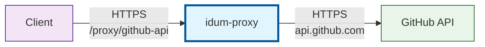

# Welcome to Idum-Proxy

With Idum-Proxy, you can proxify backends api for simple adding new features of backend api.

By example with the api of github, a new url `/proxy/github-api` is configured to call the api github and to save the result in a cache.
The next calls read the data in the cache and don't call the

