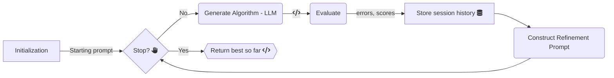

<p align="center">
  <picture>
    <source media="(prefers-color-scheme: dark)" srcset="logo-dark.png">
    <source media="(prefers-color-scheme: light)" srcset="logo.png">
    
  </picture>
</p>

<h1 align="center">LLaMEA: Large Language Model Evolutionary Algorithm</h1>

<p align="center">
  <a href="https://pypi.org/project/llamea/">
    
  </a>
  
  
  <a href="https://codecov.io/gh/XAI-liacs/LLaMEA" > 
     
 </a>
  <a href="https://doi.org/10.5281/zenodo.13842144"></a>
</p>

> **The fully-open alternative to Google DeepMind’s AlphaEvolve.  
> First released 📅 Nov 2024 • MIT License • 100 % reproducible.**

LLaMEA couples large-language-model reasoning with an evolutionary loop to **invent, mutate and benchmark algorithms fully autonomously**.  

## Table of Contents
- [Introduction](#introduction)
- [News](#-news)
- [Installation](#-installation)
- [Quick Start](#-quick-start)
- [Examples](#-examples)
  - [Running `example.py`](#running-examplepy)
  - [Running `example_HPO.py` (LLaMEA-HPO)](#running-example_hpopy-llamea-hpo)
  - [Running `example_AutoML.py`](#running-example_automlpy)
- [Contributing](#-contributing)
- [License](#-license)
- [Citation](#-citation)


## Introduction

**LLaMEA** (Large Language Model Evolutionary Algorithm) is an innovative framework that leverages the power of large language models (LLMs) such as GPT-4 for the automated generation and refinement of metaheuristic optimization algorithms. The framework utilizes a novel approach to evolve and optimize algorithms iteratively based on performance metrics and runtime evaluations without requiring extensive prior algorithmic knowledge. This makes LLaMEA an ideal tool for both research and practical applications in fields where optimization is crucial.

**Key Features:**  
- **Automated Algorithm Generation**: Automatically generates and refines algorithms using GPT-based or similar LLM models.
- **Performance Evaluation**: Integrates seamlessly with the IOHexperimenter for real-time performance feedback, guiding the evolutionary process.
- **LLaMEA-HPO**: Provides an in-the-loop hyper-parameter optimization mechanism (via SMAC) to offload numerical tuning, so that LLM queries focus on novel structural improvements.
- **Extensible & Modular**: You can easily integrate additional models and evaluation tools.

<p align="center">
  
</p>

**Example use-cases:**
- **Problem specific optimization algorithms**: Easily generate and fine-tune optimization algorithms to work on **your specific** problem. By leveraging problem knowledge in the prompt the generated optimzed algorithms can perform even better.
- **Efficient new Bayesian Optimization algorithms**: Generate optimized and novel Bayesian optimization algorithms, specifically for optimzing very expensive problems such as auto-motive crash worthiness or car shape design optimization tasks.
- **Machine Learning Pipelines**: Without any ML knowledge, you can use LLaMEA to generate optimized machine learning pipelines for any task. Just insert the task description and provide the dataset and evaluation metric and start LLaMEA.


## 🔥 News 

+ 2025.06 🎉🎉 **["LLaMEA-BO: A Large Language Model Evolutionary Algorithm for Automatically Generating Bayesian Optimization Algorithms"](https://arxiv.org/abs/2505.21034) published on Arxiv**!  

+ 2025.05 🎉🎉 **["Optimizing Photonic Structures with Large Language Model Driven Algorithm Discovery"](https://arxiv.org/abs/2503.19742) accepted as workshop paper at GECCO 2025**!  

+ 2025.05 🎉🎉 **["BLADE: Benchmark Suite for LLM-Driven Automated Design and Evolution of iterative optimisation heuristics"](https://arxiv.org/abs/2504.20183) accepted as workshop paper at GECCO 2025**!  

+ 2025.04 🎉🎉 **["Code Evolution Graphs"](https://arxiv.org/abs/2503.16668) accepted as full paper at GECCO 2025**!  

+ 2025.03 🎉🎉 **LLaMEA v1.0.0 released**!  

+ 2025.01 🎉🎉 **LLaMEA paper accepted in IEEE TEVC** [“Llamea: A large language model evolutionary algorithm for automatically generating metaheuristics"](https://ieeexplore.ieee.org/abstract/document/10752628/)!  


## 🎁 Installation

It is the easiest to use LLaMEA from the pypi package.

```bash
  pip install llamea
```
> [!Important]
> The Python version **must** be larger or equal to Python 3.10.
> You need an OpenAI/Gemini/Ollama API key for using LLM models.

You can also install the package from source using Poetry (1.8.5).

1. Clone the repository:
   ```bash
   git clone https://github.com/XAI-liacs/LLaMEA.git
   cd LLaMEA
   ```
2. Install the required dependencies via Poetry:
   ```bash
   poetry install
   ```

## 💻 Quick Start

1. Set up an OpenAI API key:
   - Obtain an API key from [OpenAI](https://openai.com/).
   - Set the API key in your environment variables:
     ```bash
     export OPENAI_API_KEY='your_api_key_here'
     ```

2. Running an Experiment

    To run an optimization experiment using LLaMEA:

    ```python
    from llamea import LLaMEA

    # Define your evaluation function
    def your_evaluation_function(solution):
        # Implementation of your function
        # return feedback, quality score, error information
        return "feedback for LLM", 0.1, ""

    # Initialize LLaMEA with your API key and other parameters
    optimizer = LLaMEA(f=your_evaluation_function, api_key="your_api_key_here")

    # Run the optimizer
    best_solution, best_fitness = optimizer.run()
    print(f"Best Solution: {best_solution}, Fitness: {best_fitness}")
    ```

---

## 💻 Examples

Below are two example scripts demonstrating LLaMEA in action for black-box optimization with a BBOB (24 noiseless) function suite. One script (`example.py`) runs basic LLaMEA, while the other (`example_HPO.py`) incorporates a **hyper-parameter optimization** pipeline—known as **LLaMEA-HPO**—that employs SMAC to tune the algorithm’s parameters in the loop.

### Running `example.py`

**`example.py`** showcases a straightforward use-case of LLaMEA. It:
- Defines an evaluation function `evaluateBBOB` that runs generated algorithms on a standard set of BBOB problems (24 functions).
- Initializes LLaMEA with a specific model (e.g., GPT-4, GPT-3.5) and prompts the LLM to generate metaheuristic code.
- Iterates over a `(1+1)`-style evolutionary loop, refining the code until a certain budget is reached.

**How to run:**
```bash
python example.py
```

The script will:
1. Query the specified LLM with a prompt describing the black-box optimization task.
2. Dynamically execute each generated algorithm on BBOB problems.
3. Log performance data such as AOCC (Area Over the Convergence Curve).
4. Iteratively refine the best-so-far algorithms.


### Running `example_HPO.py` (LLaMEA-HPO)

**`example_HPO.py`** extends LLaMEA with **in-the-loop hyper-parameter optimization**—termed **LLaMEA-HPO**. Instead of having the LLM guess or refine hyper-parameters directly, the code:
- Allows the LLM to generate a Python class representing the metaheuristic **plus** a ConfigSpace dictionary describing hyper-parameters.
- Passes these hyper-parameters to SMAC, which then searches for good parameter settings on a BBOB training set.
- Evaluates the best hyper-parameters found by SMAC on the full BBOB suite.
- Feeds back the final performance (and errors) to the LLM, prompting it to mutate the algorithm’s structure (rather than simply numeric settings).
  
**Why LLaMEA-HPO?**  
Offloading hyper-parameter search to SMAC significantly reduces LLM query overhead and encourages the LLM to focus on novel structural improvements.

**How to run:**
```bash
python example_HPO.py
```

**Script outline:**
1. **Prompt & Generation**: Script sets up a role/task prompt, along with hyper-parameter config space templates.
2. **HPO Step**: For each newly generated algorithm, SMAC tries different parameter values within a budget.
3. **Evaluation**: The final best configuration from SMAC is tested across BBOB instances.
4. **Refinement**: The script returns the performance to LLaMEA, prompting the LLM to mutate the algorithm design.

> [!Note]
> Adjust the model name (`ai_model`) or API key as needed in the script.
> Changing `budget` or the HPO budget can drastically affect runtime and cost.
> Additional arguments (e.g., logging directories) can be set if desired.

### Running `example_AutoML.py`

**`example_AutoML.py`** uses LLaMEA to showcase that it can not only evolve and generate metaheuristics but also all kind of other algorithms, such as Machine Learning pipelines.  
In this example, a basic classification task on the breast-cancer dataset from sklearn is solved by generating and evolving open-ended ML pipelines.
- We define the evaluate function (accuracy score on a hold-out test set)
- We provide a very basic example code to get the algorithm started.
- We run a few iterations and observe the excellent performance of our completely automatic ML pipeline.
  
**How to run:**
```bash
python example_AutoML.py
```
> [!Note]
> Adjust the model name (`ai_model`) or API key as needed in the script.

---

## 🤖 Contributing

Contributions to LLaMEA are welcome! Here are a few ways you can help:

- **Report Bugs**: Use [GitHub Issues](https://github.com/XAI-liacs/LLaMEA/issues) to report bugs.
- **Feature Requests**: Suggest new features or improvements.
- **Pull Requests**: Submit PRs for bug fixes or feature additions.

Please refer to CONTRIBUTING.md for more details on contributing guidelines.

## 🪪 License

Distributed under the [MIT](https://choosealicense.com/licenses/mit/) License. See `LICENSE` for more information.


## 🤖 Reproducability

Each paper we published also has an accompanying Zenodo repository for full reproducability of all our results.

* van Stein, N. (2025). BLADE - Code and Results for the paper [Data set]. Zenodo. [https://doi.org/10.5281/zenodo.15119985](https://doi.org/10.5281/zenodo.15119985)
* van Stein, N., Vermetten, D., & Bäck, T. (2025). LLaMEA-HPO: code, generated algorithms and IOH logging data. [https://doi.org/10.5281/zenodo.14917719](https://doi.org/10.5281/zenodo.14917719)
* van Stein, N., Kononova, A. V., Kotthoff, L., & Bäck, T. (2025). Figures and code for Code Evolution Graphs. Zenodo. [https://doi.org/10.5281/zenodo.14770672](https://doi.org/10.5281/zenodo.14770672)
* van Stein, N., & Bäck, T. (2024). LLaMEA. Zenodo. [https://doi.org/10.5281/zenodo.13842144](https://doi.org/10.5281/zenodo.13842144)


## ✨ Citation

If you use LLaMEA in your research, please consider citing the associated paper:

```bibtex
@ARTICLE{van2025llamea,
  author={Stein, Niki van and Bäck, Thomas},
  journal={IEEE Transactions on Evolutionary Computation}, 
  title={LLaMEA: A Large Language Model Evolutionary Algorithm for Automatically Generating Metaheuristics}, 
  year={2025},
  volume={29},
  number={2},
  pages={331-345},
  keywords={Benchmark testing;Evolutionary computation;Metaheuristics;Codes;Large language models;Closed box;Heuristic algorithms;Mathematical models;Vectors;Systematics;Automated code generation;evolutionary computation (EC);large language models (LLMs);metaheuristics;optimization},
  doi={10.1109/TEVC.2024.3497793}
}
```

If you only want to cite the LLaMEA-HPO variant use the folllowing:

```bibtex
@article{van2024intheloop,
  author = {van Stein, Niki and Vermetten, Diederick and B\"{a}ck, Thomas},
  title = {In-the-loop Hyper-Parameter Optimization for LLM-Based Automated Design of Heuristics},
  year = {2025},
  publisher = {Association for Computing Machinery},
  address = {New York, NY, USA},
  url = {https://doi.org/10.1145/3731567},
  doi = {10.1145/3731567},
  note = {Just Accepted},
  journal = {ACM Trans. Evol. Learn. Optim.},
  month = apr,
  keywords = {Code Generation, Heuristic Optimization, Large Language Models, Evolutionary Computation, Black-Box Optimization, Traveling Salesperson Problems}
}
```

Other works about extensions or integrations of LLaMEA:

```bibtex
@InProceedings{yin2024controlling,
  author="Yin, Haoran and Kononova, Anna V. and B{\"a}ck, Thomas and van Stein, Niki",
  editor="Garc{\'i}a-S{\'a}nchez, Pablo and Hart, Emma and Thomson, Sarah L.",
  title="Controlling the Mutation in Large Language Models for the Efficient Evolution of Algorithms",
  booktitle="Applications of Evolutionary Computation",
  year="2025",
  publisher="Springer Nature Switzerland",
  address="Cham",
  pages="403--417",
  isbn="978-3-031-90065-5"
}
```

---

For more details, please refer to the documentation and tutorials available in the repository.



---

CodeCov test coverage

 

