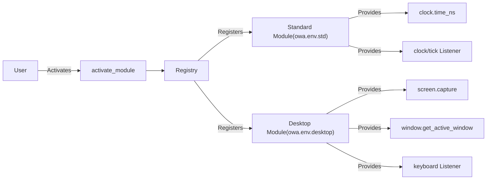

# Comprehensive Guide for Env

## Core Concepts

### Three Main Components:

Open World Agents (OWA)'s **Env** consists of three primary components that enable interaction with the environment in different ways.

1. **Callable** - Functions you actively call to perform actions or get state
    - *These are like traditional function calls; you invoke them when you need to perform an action or retrieve some information from the environment.*
    - Implements `__call__` function
    - Example: `CALLABLES["clock.time_ns"]()`

2. **Listener** - Components that respond to events and execute your callbacks
    - *Listeners wait for specific events and execute your callback functions when those events occur.*
    - Takes a `callback` parameter in the `configure` method
    - Example:
```python
listener = LISTENERS["keyboard"]().configure(callback=my_callback)
with listener.session:
    input("Type enter to exit.")
```
*This example sets up a keyboard listener that invokes `my_callback` whenever a keyboard event is detected.*

3. **Runnable** - Background processes that can be started and stopped
    - *Runnables run in the background and can be managed with start and stop operations.*
    - Parent class of `Listener`, the only difference is absence of `callback` argument in `configure`.
    - Supports `start()`, `stop()`, and `join()` operations

!!! callable vs listener "What's the difference between **Callable** and **Listener**?"
    The key difference between these two is who initiates the call:

    - In **Callable**, **caller** actively executes the Callable.
    - In **Listener**, **callee** waits for events and then calls user-provided "callbacks".

    *In other words, Callables are synchronous functions you call directly, while Listeners are asynchronous and react to events.*

    Common environmental interfaces such as [gymnasium.Env](https://gymnasium.farama.org/api/env/) only provides object/method equivalent to **Callable**.

### Registry System

*The OWA environment uses a registry system to manage and access the various components.*

Components are managed through global registries:

- `CALLABLES` - Dictionary of callable functions

- `LISTENERS` - Dictionary of event listeners

- `RUNNABLES` - Dictionary of background processes  

Modules are activated using:
```python
from owa.core.registry import activate_module
activate_module("module.name")
```
*Activating a module registers its components into the global registries for use.*

## Environment Usage Examples

### Standard Environment (`owa.env.std`)

*Here is an example of how to use the standard environment to interact with clock functionalities.*

```python
import time
from owa.core.registry import CALLABLES, LISTENERS, activate_module

# Initial registry state (empty)
print(CALLABLES, LISTENERS)  # {}, {}

# Activate the standard module to register clock functionalities
activate_module("owa.env.std")
print(CALLABLES, LISTENERS)
# {'clock.time_ns': <built-in function time_ns>} {'clock/tick': <class 'owa.env.std.clock.ClockTickListener'>}

# Testing the clock/tick listener
tick = LISTENERS["clock/tick"]().configure(callback=lambda: print(CALLABLES["clock.time_ns"]()), interval=1)
tick.start()

time.sleep(2)  # The listener prints the current time in nanoseconds a few times

tick.stop(), tick.join()
```
*In this example, we activate the standard module, which registers clock functions and listeners. We then set up a tick listener that prints the current time every second.*


Instead of manual `start-stop-join` procedure, you may utilize context manager: `.session`! Following example shows how to abbreviate `start-stop-join` steps.

```python
with tick.session:
    time.sleep(2)
```

### Desktop Environment (`owa.env.desktop`)

*The desktop environment module provides capabilities for UI interaction and input handling.*

```python
from owa.core.registry import CALLABLES, LISTENERS, activate_module
from owa.env.desktop.msg import KeyboardEvent

# Activate the desktop module to enable UI and input capabilities
activate_module("owa.env.desktop")

# Using screen capture and window management features
print(f"{CALLABLES['screen.capture']().shape=}")  # Example output: (1080, 1920, 3)
print(f"{CALLABLES['window.get_active_window']()=}")
print(f"{CALLABLES['window.get_window_by_title']('open-world-agents')=}")

# Simulating a mouse click (left button, double click)
mouse_click = CALLABLES["mouse.click"]
mouse_click("left", 2)


# Configuring a keyboard listener
def on_keyboard_event(keyboard_event: KeyboardEvent):
    print(f"Keyboard event: {keyboard_event.event_type=}, {keyboard_event.vk=}")


keyboard_listener = LISTENERS["keyboard"]().configure(callback=on_keyboard_event)
with keyboard_listener.session:
    input("Type enter to exit.\n")
```
*This code demonstrates capturing the screen, retrieving window information, simulating mouse clicks, and listening to keyboard events.*

### Custom EnvPlugin Example

Also, you can register your own EnvPlugin which contains custom **Callable**, **Listener**, or **Runnable**. For more information, see [Custom EnvPlugin](custom_plugins.md).

*Creating custom plugins allows you to extend the OWA environment with your own functionalities.*

```python
import time
from owa.core import Listener
from owa.core.registry import CALLABLES, LISTENERS

# Register your custom callables
@CALLABLES.register("my_module.add")
def __call__(a, b):
    return a + b

# Register a custom listener
@LISTENERS.register("my_module/events")
class EventListener(Listener):
    def on_configure(self, *args):
        self.args = args
        
    def loop(self, *, stop_event, callback):
        while not stop_event.is_set():
            callback("Event")
            time.sleep(1)

# Using the custom module
result = CALLABLES["my_module.add"](5, 3)  # Returns 8
```
*In this example, we define a custom module with an add function and a custom event listener.*

## Architecture Summary

*The diagram below summarizes the architecture of the OWA environment and how components are registered and used.*



## Additional Resources

- For standard module details: [owa-env-std](plugins/std.md)
- For desktop features: [owa-env-desktop](plugins/desktop_env.md)
- For multimedia support: [owa-env-gst](plugins/gstreamer_env.md)
- For custom EnvPlugin development: [custom_plugins.md](custom_plugins.md)