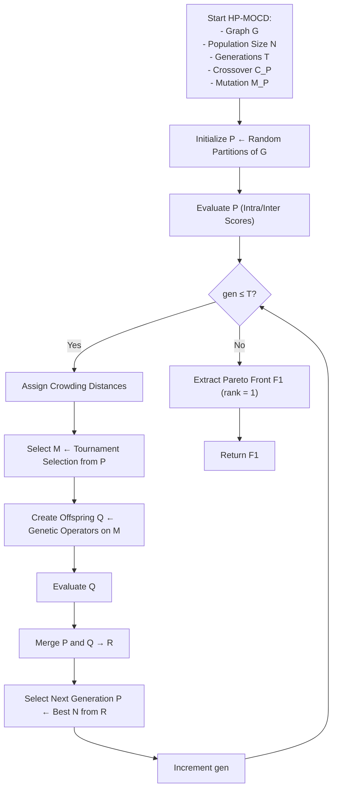

The High-Performance Multi-Objective Community Detection (HP-MOCD) algorithm is a scalable evolutionary method designed to efficiently identify high-quality community partitions in large complex networks. HP-MOCD combines the NSGA-II optimization framework with a parallel architecture and topology-aware genetic operators tailored to the structure of real-world graphs. In addition to detailing its core components, we describe the algorithm’s design choices, solution representation, and multi-objective selection strategy. The implementation is written in [Rust](https://www.rust-lang.org/) for performance and exposed to Python via [PyO3](https://pyo3.rs/v0.24.0/). The full source code is publicly available on [GitHub](https://oliveira-sh.github.io/pymocd/).

{}


### Overview and Design Rationale

Let us consider a graph \( G = (V, E) \), where \( V \) is the set of nodes and \( E \) the set of edges. The objective of the **HP-MOCD** (Hybrid Parallel Multi-Objective Community Detection) algorithm is to uncover meaningful community structures by **simultaneously optimizing multiple, often conflicting, structural criteria**.

To achieve this, HP-MOCD is built upon the **NSGA-II** (Non-dominated Sorting Genetic Algorithm II) framework, a well-established method in multi-objective optimization. NSGA-II was chosen due to its strong ability to produce diverse, high-quality Pareto fronts, especially when compared to older algorithms like **PESA-II** \[Diosan2007], which often struggle with diversity maintenance or selection pressure.

---

### Optimization Strategy

The HP-MOCD algorithm proceeds in two main phases:

1. **Initialization Phase**:  
   A population of potential community partitions (called *individuals*) is randomly generated. Each individual is a possible assignment of nodes to communities.

2. **Evolutionary Phase**:  
   The population evolves through a number of generations using genetic operators—**selection**, **crossover**, and **mutation**. At each generation, individuals are evaluated, ranked, and filtered to maintain only the most promising solutions.

This high-level flow is summarized below.

---

#### Algorithm 1: HP-MOCD Workflow



---

### Objectives and Representation

The optimization targets two structural objectives:

* **Intra-Community Connectivity**
  Measures how densely connected nodes are within each community. This objective is maximized (or its penalty minimized) to encourage cohesive clusters.

* **Inter-Community Separation**
  Measures the extent of connections between different communities. This is minimized to promote structural separation and distinct boundaries.

Together, these form a **multi-objective problem**, where each solution represents a trade-off between internal density and external separation.

---

### Internal Graph Representation

Internally, the graph $G$ is stored using a **hash map** (via Rust’s high-performance `rustc-hash`) mapping each node to its neighbor list. This ensures:

* Fast access/modification during evolution
* Efficient computation of objective functions
* Scalability for large graphs

Each individual (solution) is encoded as a mapping from node IDs to community IDs:

```python
{ node_1: community_3, node_2: community_1, ... }
```

This compact representation supports fast mutations and evaluations during the evolutionary cycle.

---

### Outcome: The Pareto Front

After evolution, the algorithm outputs a **Pareto front**: a set of non-dominated solutions, where no solution is strictly better than another in both objectives. Each solution in the front offers a different perspective on community structure—some favoring tighter internal connectivity, others prioritizing clearer community boundaries.

This gives the user full control to select a result based on downstream needs or metrics like **modularity**, **conductance**, or **custom heuristics**.

---

[^1]: HP-MOCD uses [`rustc-hash`](https://github.com/rust-lang/rustc-hash), a fast, deterministic hash function used internally by Rust. It ensures performance without cryptographic guarantees.