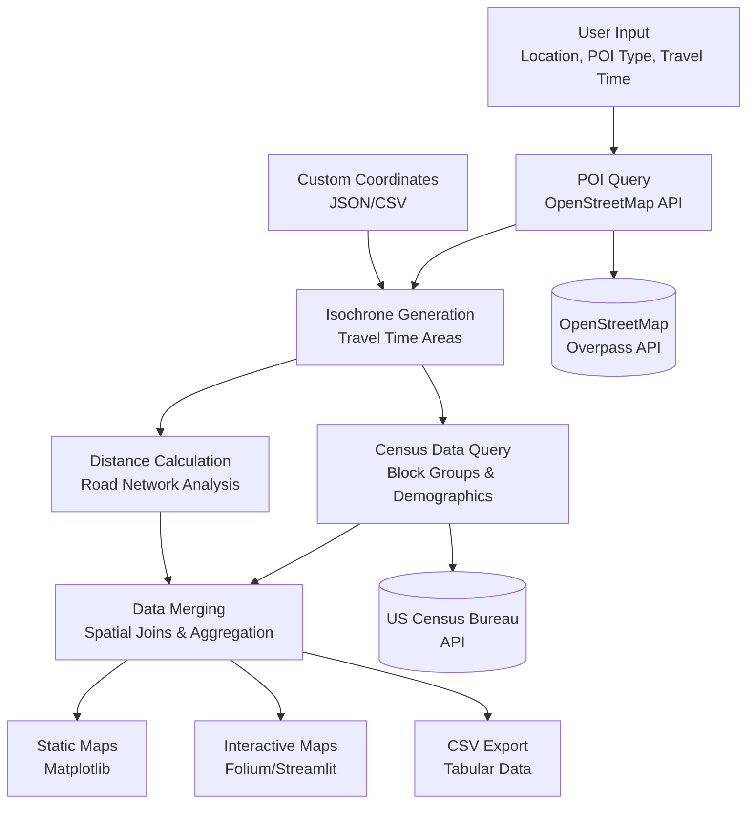

# SocialMapper Architecture Overview

This document provides a comprehensive overview of the SocialMapper codebase architecture, including module relationships, data flow, and key components.

## System Architecture Diagram

```mermaid
graph TB
    %% User Interfaces
    subgraph "User Interfaces"
        CLI[CLI Interface<br/>cli.py]
        StreamlitApp[Streamlit Web App<br/>ui/app.py]
        PythonAPI[Python API<br/>__init__.py]
    end

    %% Core Processing Engine
    subgraph "Core Processing Engine"
        CoreModule[Core Module<br/>core.py]
        ConfigModels[Configuration Models<br/>config_models.py]
        Neighbors[Neighbor Analysis<br/>neighbors.py]
    end

    %% Data Processing Pipeline
    subgraph "Processing Pipeline"
        QueryProc[Query Processing<br/>processing/query/]
        IsochroneProc[Isochrone Processing<br/>processing/isochrone/]
        DistanceProc[Distance Processing<br/>processing/distance/]
        ExportProc[Export Processing<br/>processing/export/]
    end

    %% Data Sources & Management
    subgraph "Data Sources"
        OSMData[OpenStreetMap<br/>POI Data]
        CensusData[US Census Bureau<br/>Demographics]
        CustomCoords[Custom Coordinates<br/>JSON/CSV Files]
        GeographyData[Geography Data<br/>data/geography/]
    end

    %% Specialized Modules
    subgraph "Specialized Modules"
        CensusModule[Census Module<br/>census/]
        CountiesModule[Counties Module<br/>counties/]
        StatesModule[States Module<br/>states/]
        IsochroneModule[Isochrone Module<br/>isochrone/]
        DistanceModule[Distance Module<br/>distance/]
        QueryModule[Query Module<br/>query/]
        ExportModule[Export Module<br/>export/]
    end

    %% Visualization & Output
    subgraph "Visualization & Output"
        VisualizationCore[Visualization Core<br/>visualization/core/]
        FoliumMaps[Interactive Maps<br/>visualization/folium_map.py]
        StaticMaps[Static Maps<br/>visualization/single_map.py]
        PanelMaps[Panel Maps<br/>visualization/panel_map.py]
        MapCoordinator[Map Coordinator<br/>visualization/map_coordinator.py]
        MapUtils[Map Utilities<br/>visualization/map_utils.py]
    end

    %% Utilities & Support
    subgraph "Utilities & Support"
        UtilsModule[Utils Module<br/>utils/]
        ProgressModule[Progress Tracking<br/>progress/]
        ConfigModule[Configuration<br/>config/]
    end

    %% Data Flow Connections
    CLI --> CoreModule
    StreamlitApp --> CoreModule
    PythonAPI --> CoreModule
    
    CoreModule --> ConfigModels
    CoreModule --> Neighbors
    CoreModule --> QueryProc
    CoreModule --> IsochroneProc
    CoreModule --> DistanceProc
    CoreModule --> ExportProc
    
    QueryProc --> QueryModule
    QueryProc --> OSMData
    QueryProc --> CustomCoords
    
    IsochroneProc --> IsochroneModule
    DistanceProc --> DistanceModule
    ExportProc --> ExportModule
    
    CensusModule --> CensusData
    CountiesModule --> GeographyData
    StatesModule --> GeographyData
    
    CoreModule --> CensusModule
    CoreModule --> CountiesModule
    CoreModule --> StatesModule
    
    CoreModule --> VisualizationCore
    VisualizationCore --> FoliumMaps
    VisualizationCore --> StaticMaps
    VisualizationCore --> PanelMaps
    VisualizationCore --> MapCoordinator
    VisualizationCore --> MapUtils
    
    CoreModule --> UtilsModule
    CoreModule --> ProgressModule
    CoreModule --> ConfigModule
    
    %% External Dependencies
    OSMData -.-> |"overpy, osmnx"| QueryModule
    CensusData -.-> |"cenpy"| CensusModule
    FoliumMaps -.-> |"folium, streamlit-folium"| StreamlitApp
    StaticMaps -.-> |"matplotlib, contextily"| CoreModule
```

## Data Flow Architecture

## Key Components Description

### User Interfaces
- **CLI Interface**: Command-line tool for batch processing and automation
- **Streamlit Web App**: Interactive web interface for exploratory analysis
- **Python API**: Programmatic access for integration with other tools

### Core Processing Engine
- **Core Module**: Main orchestration logic and entry points
- **Configuration Models**: Pydantic models for configuration validation
- **Neighbor Analysis**: Geographic neighbor relationship management

### Processing Pipeline
- **Query Processing**: Handles POI queries and custom coordinate parsing
- **Isochrone Processing**: Generates travel time accessibility areas
- **Distance Processing**: Calculates road network distances
- **Export Processing**: Handles data export in various formats

### Specialized Modules
- **Census Module**: Interface with US Census Bureau APIs
- **Counties/States Modules**: Geographic boundary management
- **Query/Distance/Isochrone Modules**: Core algorithmic implementations

### Visualization & Output
- **Interactive Maps**: Folium-based web maps with Streamlit integration
- **Static Maps**: Matplotlib-based publication-ready maps
- **Map Coordination**: Orchestrates multiple map generation workflows

## Technology Stack

### Core Dependencies
- **GeoPandas**: Spatial data manipulation and analysis
- **Pandas/NumPy**: Data processing and numerical computation
- **Shapely**: Geometric operations and spatial analysis
- **NetworkX**: Graph analysis for road networks

### Mapping & Visualization
- **Folium**: Interactive web maps
- **Matplotlib**: Static map generation
- **Contextily**: Basemap tiles and styling
- **Streamlit**: Web application framework

### External Data Sources
- **OpenStreetMap**: POI data via Overpass API (overpy, osmnx)
- **US Census Bureau**: Demographic data via API (cenpy)
- **Custom Data**: User-provided coordinates (JSON/CSV)

### Performance & Optimization
- **PyArrow**: Fast data serialization
- **Caching**: Network request caching for performance
- **Vectorized Operations**: NumPy/Pandas optimizations

## Design Patterns

### Modular Architecture
The codebase follows a modular design with clear separation of concerns:
- **Interface Layer**: Multiple user interfaces (CLI, Web, API)
- **Business Logic Layer**: Core processing and algorithms
- **Data Access Layer**: External API integrations and file I/O
- **Presentation Layer**: Visualization and export functionality

### Configuration Management
- Centralized configuration using Pydantic models
- Environment variable support via python-dotenv
- Flexible parameter passing across interfaces

### Error Handling & Resilience
- Graceful degradation when optional dependencies are missing
- Comprehensive error handling for external API failures
- Progress tracking for long-running operations

This architecture enables SocialMapper to be both powerful for advanced users and accessible for beginners, while maintaining good performance and reliability across different use cases. 