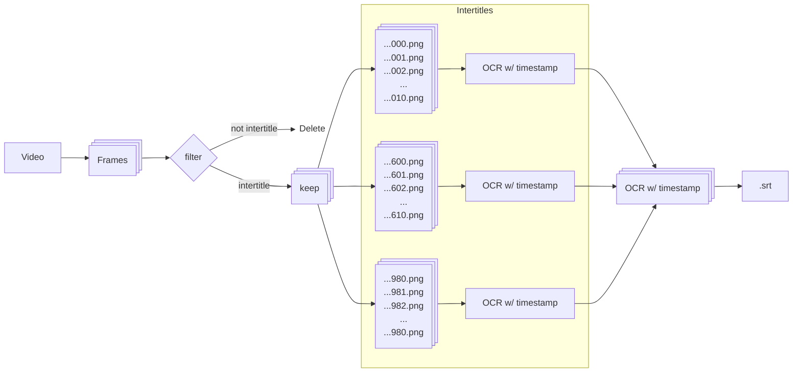

[](https://github.com/pre-commit/pre-commit)
[](https://github.com/pypa/hatch)
[](https://github.com/Modern36/stum/actions/workflows/hatch-publish-to-pypi.yml)
[](https://doi.org/10.5281/zenodo.15576415)


# stum

`stum` is a tool for detecting and extracting text from intertitles in silent
films. It was developed and tested specifically for Swedish newsreels.

## Installation

1. Install `stum` either:
    - `pipx install stum`
    - `python -m pip install stum`
    - `python -m pip install -e '.[dev]'` (for development)
2. Install ffmpeg:
    - MacOS (with Homebrew): `brew install ffmpeg`
    - Debian: `sudo apt-get install ffmpeg`
3. Install tesseract:
    - MacOS (with Homebrew): `brew install tesseract`
    - Debian: `sudo apt-get install tesseract`

4. Install the Swedish OCR model for Tesseract:
    - Download the [Swedish model](https://github.com/tesseract-ocr/tessdata/raw/refs/heads/main/swe.traineddata)
    - Place it in the appropriate tessdata folder:
        - MacOS (with Homebrew): `/opt/homebrew/share/tessdata`
        - Linux: `/usr/share/tesseract-ocr/4.00/tessdata`

5. Download the EAST model for text detection:
   - [EAST model](https://github.com/ZER-0-NE/EAST-Detector-for-text-detection-using-OpenCV/raw/refs/heads/master/frozen_east_text_detection.pb)
    - Place it in the `./models` folder of this repository.

6. For development, also run:
   - `pre-commit install` (to set up pre-commit hooks)

## CLI Usage

```sh
stum -i input.mpg
```

```sh
stum -i input_dir_with_mp4s/
```

**Input:**
- Video file.
- Directory of video files.

**Output:**
- One .srt file per input video.

**Flags:**
```
  -i, --input INPUT  Input video (.mpg) or directory of videos (.mpg)
  -s, --skip         Skip files that already have an .srt file.
  -d, --debug        Activate Debug mode. Saves intertitle frames for each video.
```

## Test data

The test data, frames and videos used to test the library, are placed in
[another repo](https://github.com/Modern36/stum_data.git) as a submodule. This
repo is only necessary for testing, and is not necessary for using the library.
Some of the test data is of a somewhat sensitive nature, and the repo is
therefore private.

### Tesseract accuracy
The following frame is extracted from one of our sample videos, manually
selected in an early experiment to ascertain the accuracy of raw Tesseract.


English:

```
C= PULMUNDESTRIS VECKOREVY 1038

MR G.
har invigt en ny tennisbana pa
Sard — ett led i 70-arsjubileets
hugfastande.

```

Which already is very good, the Swedish model:

```
(%nm- FILMINDUSTRIS VECKOREVY 1028

MR G.
har invigt en ny tennisbana på
Särö — ett led i 70-årsiubileets
hugfästande.

```

Which is notably better, but fails to recognize the 'j' in 'årsjubileets'.

### How many frames? All the frames

Normally one would not need to extract all frames from a video. However, many
of the digitized Swedish newsreels only contain a single, or very few, frames
of every intertitle as shown by the following three sequential frames:


It also showcases another problem that needs to be corrected for: some
intertitles are mirrored vertically.

### Workflow

By first grouping the frames into sequences/shots first, the computational time
is significantly reduced. This is logical since the OCR portion is the most
time-consuming. The currently implemented approach works according to the
following diagram:



1. Extract all the frames.
2. Group frames into subdirectories based on image similarity (MSE).
3. Only keep the sequences that pass the contour + OCR filters.
4. Merge consequtive frequences that have a very similar OCR output.
5. Use frame numbers and .txt to generate an .srt string.

## Research Context and Licensing

### Modern Times 1936

stum was developed for the
[Modern Times 1936](https://modernatider1936.se/en/) research
[project at Lund University](https://portal.research.lu.se/sv/projects/modern-times-1936-2),
Sweden. The project investigates what software "sees," "hears," and "perceives"
when pattern recognition technologies such as 'AI' are applied to media
historical sources. The project is
[funded by Riksbankens Jubileumsfond](https://www.rj.se/bidrag/2021/moderna-tider-1936/).

### License

stum is licensed under the [CC-BY-NC 4.0](./LICENSE) International license.

## References

```bibtex
@inproceedings{zhou2017east,
  title={East: an efficient and accurate scene text detector},
  author={Zhou, Xinyu and Yao, Cong and Wen, He and Wang, Yuzhi and Zhou, Shuchang and He, Weiran and Liang, Jiajun},
  booktitle={Proceedings of the IEEE conference on Computer Vision and Pattern Recognition},
  pages={5551--5560},
  year={2017}
}
```
