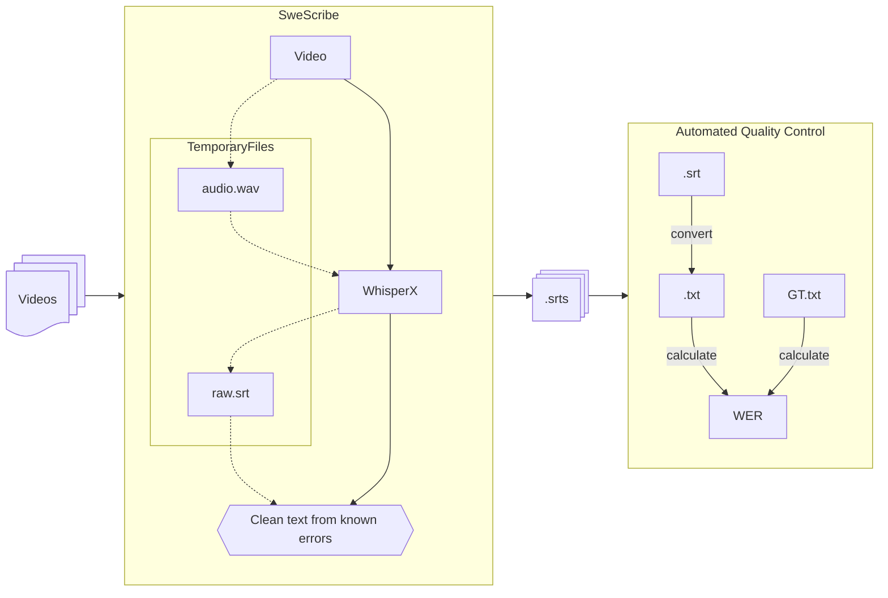

[](https://github.com/pre-commit/pre-commit)
[](https://github.com/pypa/hatch)
---

# SweScribe

SweScribe has been developed and tested for the use case of transcribing speech
from Swedish historical newsreels, making their content searchable, indexable,
and easier to study within the broader framework of media history research. It
is essentially a wrapper around WhisperX, which in turn combines Whisper and
Wav2Vec2 to create transcriptions with timestamps.

The primary files used for this project are publicly available on
[Filmarkivet.se](https://www.filmarkivet.se/), a web
resource containing curated parts of Swedish film archives.


## Installation and usage

This repository is built around the
[WhisperX](https://pypi.org/project/whisperx/), which is built and tested on
`python3.10`.

### Installation

1. Download this repository and install the dependencies with:

```
git clone https://github.com/Modern36/swescribe.git
cd swescribe
python -m pip install .[whisperx]
```

or

```
python -m pip install swescribe
```

2. Install ffmpeg:
    - MacOS (with Homebrew): `brew install ffmpeg`
    - Debian: `sudo apt-get install ffmpeg`

### Usage

Once installed `swescribe` can be run from the command line:

```
swescribe -i {input file/directory} -o {output file/directory}
```

Run the _help_ command to get list of available options:
```
swescribe --help
```

## Contributing

We welcome contributions from the community! Please read our
[Contributing Guidelines](CONTRIBUTING) to understand how to contribute to
this project. We follow a code review process, so all pull requests will be
reviewed before merging.

## License

This project is licensed under the CC-BY-NC 4.0 license. - see the
[LICENSE](LICENSE) file for details.

# Project structure

## File structure for test data

```
/data
├── /wav_input   (Audio extracted from videos)
│   └── file_x.wav
│   └── file_y.wav
│   └── file_z.wav
├── /txt_output
│   └── file_x.txt
│   └── file_y.txt
│   └── file_z.txt
├── /srt_output
│   └── file_x.srt
│   └── file_y.srt
│   └── file_z.srt
├── /ground_truth
│   └── file_x.txt
│   └── file_y.txt
│   └── file_z.txt
```

## The pipeline



The intended final product of this repo is an audio transcription library
suitable for swedish 1930s newsreels: _**SweScribe**_ in the diagram. It will
process video files to produce transcribed subtitles using the `.srt` standard.

**The parts**

Practically ths consists of several steps (following the solid lines)

1. Extract the video's audio

2. Pass the audio through WhisperX to get a transcription

3. Clean these transcriptions from identified systematic errors before:

4. Producing the cleaned `.srt` file.

**Need for interim parts**

Some of these steps are computationally intensive and we do not want to rerun
the whole pipeline every time we introduce a change. Which goes in stark
contrast against our need to run tests after each change to understand how
it affects the quality of the pipeline. During development, we will therefore
need to save the output from each step so that we can rerun as few parts of the
pipeline as needed, following the dashed lines down the flowchart.

**Continuous testing**

The quality control is primarily carried out through the use of the `WER` metric
calculated between the pair of each .srt file and a set of ground truth files.
27 of these are manually transcribed. The rest are initially transcribed with
WhisperX, and then manually corrected.

In the step converting from .srt files to .txt files we also have a chance to
remove segments (using timestamps) that are nigh impossible to understand,
without speech or speech in a different language. This needs to be carried before
we implement any change into the codebase -- and is always run automatically upon
PullRequests. The WER results for each file and the descriptive statistics are
stored alongside the code so that we can quickly and easily see how the performance
changes with each run (and with some effort we can later recreate a history of this metric).

### `xzy` as a replacement tokens

Words or sequences that were imperceptible during manual correction of the
automatically generated Ground Truth files were replaced by the token `xzy`. These
replacement tokens are filtered out in the WER step of the pipeline; they primarily
exist to enhance searchability.


### Running the tests manually

The pytest module can also be run with

```
python -m pytest
```
## Research Context and Licensing

### Modern Times 1936

SweScribe was developed for the
[Modern Times 1936](https://modernatider1936.se/en/) research
[project at Lund University](https://portal.research.lu.se/sv/projects/modern-times-1936-2),
Sweden. The project investigates what software "sees," "hears," and "perceives"
when pattern recognition technologies such as 'AI' are applied to media
historical sources. The project is
[funded by Riksbankens Jubileumsfond](https://www.rj.se/bidrag/2021/moderna-tider-1936/).

### License

SweScribe is licensed under the [CC-BY-NC 4.0](./LICENSE) International license.

## References

```bibtex
@article{bain2022whisperx,
  title={WhisperX: Time-Accurate Speech Transcription of Long-Form Audio},
  author={Bain, Max and Huh, Jaesung and Han, Tengda and Zisserman, Andrew},
  journal={INTERSPEECH 2023},
  year={2023}
}
```

```bibtex
@inproceedings{malmsten2022hearing,
  title={Hearing voices at the national library : a speech corpus and acoustic model for the Swedish language},
  author={Malmsten, Martin and Haffenden, Chris and B{\"o}rjeson, Love},
  booktitle={Proceeding of Fonetik 2022 : Speech, Music and Hearing Quarterly Progress and Status Report, TMH-QPSR},
  volume={3},
  year={2022}
}
```
