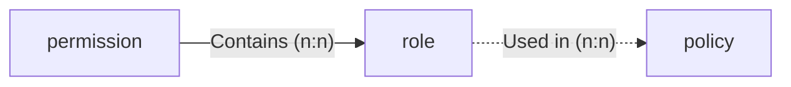

# Authorization

This document describes how to use TAuth for authorization in your applications.
We go over the following topics:

- [Authorization](#authorization)
  - [Authorization Basics](#authorization-basics)
  - [Attaching Roles to Entities](#attaching-roles-to-entities)
  - [Python Project Setup](#python-project-setup)
  - [Authorization Endpoint (`/authz`)](#authorization-endpoint-authz)

## Authorization Basics

TAuth uses a **policy-based** authorization system
To use TAuth's authorization system, you must identify which policies are needed based on your application needs and either use existing policies or create new ones.
The authorization system consists of the following objects:

| Object | Description |
| :-: | :-- |
| **Permission** | Arbitrary string that can be attached to one or more roles. |
| **Role** | Set of permissions that can be attached to one or more entities. |
| **Policy** | Set of rules with access to several informational objects (e.g., entities, roles, request data, ...) that is used to determine authorization details (i.e., authorized, access restrictions). |

The following diagram illustrates the relationship between the three main authorization objects:



During policy evaluation, the policy can also access other relevant metadata.
This metadata can be provided by TAuth itself (e.g., the authenticated user's entity, request data, ...), or it can be provided by the application itself (i.e., custom application data).
These can then be checked during policy evaluation to determine authorization rights.

TAuth currently supports one authorization engine: [Open Policy Agent](https://www.openpolicyagent.org/) (OPA).
When writing policies, you will need to use the OPA language, Rego.
You can find more information about Rego [here](https://www.openpolicyagent.org/docs/latest/policy-language/).
Permissions and roles are engine-agnostic.

## Attaching Roles to Entities

TODO.

## Python Project Setup

To use TAuth for Authorization in a Python project, we first need to set up a few environment variables to configure TAuth to use remote authorization (i.e., authorize using the main TAuth API).
You can add the following environment variables to your `.env` file:

```sh
TAUTH_AUTHZ_ENGINE="remote"
TAUTH_AUTHZ_ENGINE_SETTINGS_REMOTE_API_URL="https://tauth.allai.digital/"
```

After setting these environment variables, we can start using the TAuth middleware in our FastAPI application (see the [tauth.dependencies.authorization][tauth.dependencies.authorization module]).

You will still need to include [authentication headers](./authn.md#request-headers) in your requests.

## Authorization Endpoint (`/authz`)

The `/authz` endpoint is the main authorization endpoint, and is used to authorize users using the TAuth API.
The endpoint does not accept any parameters, and instead relies on the aforementioned authentication headers.
Here is an example of a request to the `/authz` endpoint:

```sh
curl -X POST \
  https://tauth.allai.digital/authz \
  -H 'Authorization: Bearer <token>' \
  -H 'X-User-Email: <user_email>' \
  -d '{
    "policy_name": "string",
    "rule": "string",
    "context": {}
  }'
```

Context is an optional parameter used to provide additional information to the authorization engine.
This is useful if you write policies that require validation on additional application data to work.
