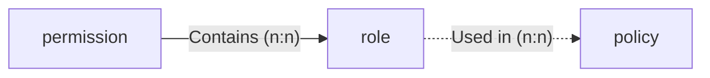
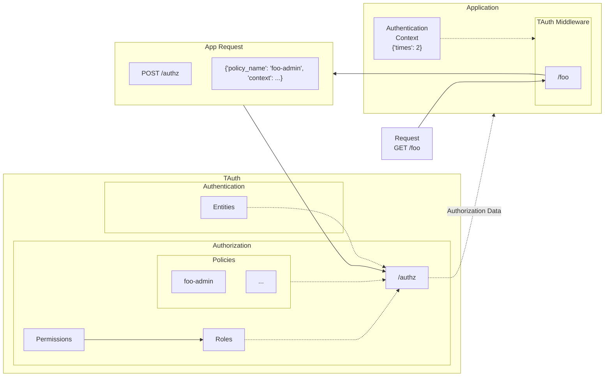

# Quickstart

!!! note
    This quickstart tutorial requires TAuth to be installed.
    If you haven't already, please follow the [installation guide](./installation.md).

In this quickstart, we'll walk through the basics of using TAuth as an end-user to protect a FastAPI application.
We'll show you how to:

- [Quickstart](#quickstart)
  - [Accessing TAuth API](#accessing-tauth-api)
  - [Creating an Organization](#creating-an-organization)
  - [Registering an AuthProvider](#registering-an-authprovider)
  - [Configuring Local Repository](#configuring-local-repository)
  - [Protecting Endpoint with Authentication](#protecting-endpoint-with-authentication)
  - [Authorization Basics](#authorization-basics)
    - [Writing Policies](#writing-policies)
    - [Protecting Endpoint with Authorization](#protecting-endpoint-with-authorization)
  - [Next Steps](#next-steps)

## Accessing TAuth API

To access TAuth's production API, you can visit [this link](https://tauth.allai.digital/docs).
You will be presented with the API's Swagger UI, which contains documentation and a playground with example requests to test the API.
You can inspect which version of TAuth is currently running by checking the tag next to the API name.
You can also programmatically acces the API.
For instance, you can check if the API is running by making a `GET` request to the healthcheck endpoint:

```sh
curl -X 'GET' 'https://tauth.allai.digital/'
```

The API is divided into the following sections:

| Section Name | Description |
| --- | --- |
| `health` | API status check. |
| `authn` | Main authentication endpoints. |
| `authz` | Main authorization endpoints and permission, role, and policy management. |
| `entities` | Endpoints for managing entities. |
| `authproviders` | Endpoints for managing authentication providers. |
| `legacy` | Endpoints for legacy (V1) support (includes MELT Key management). |

Since TAuth is intended to be a centralized security system, you will often need to interact with its API directly to create and manage your authentication and authorization settings.
The API is secured with an API key, so you will need to obtain one from the TAuth team before you can start using the API.
Once you have an API key, you can use it to make requests to the API by including it in the `Authorization` header of your requests:

```sh
curl -X 'POST' \
  'https://tauth.allai.digital/entities/' \
  -H 'accept: application/json' \
  -H 'Content-Type: application/json' \
  -H 'Authorization: Bearer <API_KEY>' \  # (1)
  ...  # (2)
```

1. Replace <API_KEY> with your API key
2. Continue with request information here

You can also input your API key in the Swagger UI by clicking the `Authorize` button in the top right corner of the Swagger UI and inputting your API key in the `Value` field.

Then you can either use TAuth's Python SDK (FastAPI middleware) or call the REST API directly to interact with the TAuth from your application.

## Creating an Organization

The first step to using TAuth is to create an entity to represent your organization.
This entity will be used to manage your authentication and authorization settings.
To create an organization, use the `POST /entities/` endpoint.
Let's create an organization called `MyOrg`:

```sh
curl -X 'POST' \
  'https://tauth.allai.digital/entities/' \
  -H 'accept: application/json' \
  -H 'Content-Type: application/json' \
  -H 'Authorization: Bearer <API_KEY>' \
  -d '{
    "handle": "/MyOrg",
    "type": "organization"
  }'  # (1)
```

1. Substitute `MyOrg` with your organization's name.

!!! tip
    The `handle` field is used to identify your organization.
    It **must** start with a forward slash for organization entities.
    For more information on entities, see the [entities section](./entity.md).

## Registering an AuthProvider

Now that we have an organization, we can start configuring our authentication and authorization settings.
We'll start by registering an authentication provider.
TAuth supports a variety of authentication providers, including Auth0 and MELT keys (API keys managed by TAuth).

!!! note
    For a full list of supported authentication providers, see the [authentication page](./authn.md).

We'll use the MELT Key provider and generate a new MELT Key for our organization and its users.
To register an authentication provider, use the `POST /authproviders/` endpoint:

```sh
curl -X 'POST' \
  'https://tauth.allai.digital/authproviders/' \
  -H 'accept: application/json' \
  -H 'Content-Type: application/json' \
  -H 'Authorization: Bearer <API_KEY>' \
  -d '{
    "organization_name": "/MyOrg",
    "type": "melt-key"
  }'
```

For now, authentication providers must be linked to organization entities.
This means that the `organization_name` field must be set to the handle of an organization entity.
The `type` field specifies the type of authentication provider we want to register (in this case, a MELT Key provider).

After registering the MELT key provider, we still need to actually create a MELT key for our organization.
To achieve this, we'll use the `/clients` endpoint from the `legacy` section:

```sh
curl -X 'POST' \
  'https://tauth.allai.digital/clients/' \
  -H 'accept: application/json' \
  -H 'Content-Type: application/json' \
  -H 'Authorization: Bearer <API_KEY>' \
  -d '{ "name": "/MyOrg" }'
```

You will then receive a MELT key with `name="default"` for your organization as a response.

!!! danger
    Whenever you generate a key, you **must** copy its secret value.
    It **cannot** be retrieved later.
    The `name` field can be used to identify the key (and its usage) later.

!!! warning
    The `default` key is not attached to any user, so you **must** inform an email in the `X-User-Email` header field to use it.
    If a user for that email does not exist, it will be created as a `user` entity.
    The parent of that entity will be the same organization entity attached to the authentication provider used.

This key has administrator privileges in the organization.
You can also create additional MELT keys with user privileges by using the `/keys` endpoint:

```sh
curl -X 'POST' \
  'https://tauth.allai.digital/keys/' \
  -H 'accept: application/json' \
  -H 'Content-Type: application/json' \
  -H 'Authorization: Bearer <API_KEY>' \
  -d '{
    "name": "<KEY_NAME>",
    "organization_handle": "/MyOrg"
  }'  # (1)
```

1. Replace `<KEY_NAME>` with the name of your key.

Now, whenever a user wants to access our application (or we wish to authenticate the application itself), they can use these keys with lower privileges.

## Configuring Local Repository

After this basic authentication setup, we can start configuring our application to use TAuth.
To do this, we'll use the TAuth Python SDK and the FastAPI-compatible middleware.
First, we'll need to install the SDK (it is recommended to use a virtual environment):

```sh
pip install tauth
```

Next, we need to set up a few environment variables to configure TAuth to use remote authentication (i.e., authenticate using the main TAuth API).
You can add the following environment variables to your `.env` file:

```sh
# Authentication
TAUTH_AUTHN_ENGINE="remote"
TAUTH_AUTHN_ENGINE_SETTINGS_API_URL="https://tauth.allai.digital/"
# Authorization
TAUTH_AUTHZ_ENGINE="remote"
TAUTH_AUTHZ_ENGINE_SETTINGS_REMOTE_API_URL="https://tauth.allai.digital/"
```

After setting these environment variables, we can start using the TAuth middleware in our FastAPI application.
To do this, we'll need to import the dependencies provided by TAuth, which are contained in the `tauth.dependencies` module.

## Protecting Endpoint with Authentication

The `tauth.dependencies.authentication` module provides the following methods to protect endpoints:

- [get_depends][tauth.dependencies.authentication.get_depends]: FastAPI dependency that can be used to individually protect endpoints.
- [init_router][tauth.dependencies.authentication.init_router]: FastAPI router that can be used to protect all endpoints in a router.
- [init_app][tauth.dependencies.authentication.init_app]: FastAPI application that can be used to protect all endpoints in an application.

After you include any authentication dependency in your application, your Swagger UI will be updated to include an `Authorize` button in the top right corner.
The endpoints that are protected will also include new header fields that specify the authentication requirements.
You can use these input fields to place your MELT key and authenticate your requests.

If a user is authenticated, you will receive an [Infostar][tauth.schemas.infostar] object, which is an object containing information on the authenticated user's entity and the authentication provider used.

## Authorization Basics

TAuth uses a **policy-based** authorization system
To use TAuth's authorization system, you must identify which policies are needed based on your application needs and either use existing policies or create new ones.
The authorization system consists of the following objects:

| Object | Description |
| :-: | :-- |
| **Permission** | Arbitrary string that can be attached to one or more roles. |
| **Role** | Set of permissions that can be attached to one or more entities. |
| **Policy** | Set of rules with access to several informational objects (e.g., entities, roles, request data, ...) that is used to determine authorization details (i.e., authorized, access restrictions). |

The following diagram illustrates the relationship between the three main authorization objects:



During policy evaluation, the policy can also access other relevant metadata.
This metadata can be provided by TAuth itself (e.g., the authenticated user's entity, request data, ...), or it can be provided by the application itself (i.e., custom application data).
These can then be checked during policy evaluation to determine authorization rights.

To illustrate the authorization process, we'll define an example policy, named `foo-admin`, with the following rules:

- Users can only access the `GET /foo` endpoint if they have the `admin` role.
- Administrators can only access the `GET /foo` endpoint twice a day.

In this case, permissions and roles are stored in TAuth, and roles need to be attached to entities.
The number of times a user can access the endpoint, on the other hand, is application-specific, so it is stored in the application itself.

The following diagram illustrates the relationship between metadata and the policy:



The first thing we need to do is create a new permission in TAuth:

```sh
curl -X 'POST' \
  'https://tauth.allai.digital/authz/permissions/' \
  -H 'accept: application/json' \
  -H 'Content-Type: application/json' \
  -H 'Authorization: Bearer <API_KEY>' \
  -d '{
    "name": "foo-read",
    "description": "Foo resource read access.",
    "entity_handle": "/MyOrg"
  }'
```

Next, we'll create a new role and attach the newly-created permission:

```sh
curl -X 'POST' \
  'https://tauth.allai.digital/authz/roles/' \
  -H 'accept: application/json' \
  -H 'Content-Type: application/json' \
  -H 'Authorization: Bearer <API_KEY>' \
  -d '{
    "name": "app-admin",
    "description": "API Administrator",
    "entity_handle": "/MyOrg",
    "permissions": ["foo-read"]
  }
```

### Writing Policies

TAuth's authorization engine uses a policy-based authorization system named [Open Policy Agent](https://www.openpolicyagent.org/) (OPA).
Policies are written in the [Rego](https://www.openpolicyagent.org/docs/latest/policy-language/) language, which is a declarative language that is used to describe policies.
To read more about writing policies in OPA/Rego, please refer to the official documentation.

Here is the policy we will create:

```rego
package tauth.melt_key

import rego.v1

# Block access by default
default allow := false

# Rule to allow access to the GET /foo endpoint
allow {
    input.request.method == "GET"
    input.request.path == "/foo"
    input.entity.roles[_] == "app-admin"
    not input.context.times > 2
}
```

OPA provides the `input` object, which contains TAuth- and user-injected data for policy evaluation.

Policies are stored in TAuth and can be managed using the `/authz/policies` endpoint.
To create a new policy, we'll use the following command:

```sh
curl -X 'PUT' \
  'https://tauth.allai.digital/authz/policies/' \
  -H 'accept: application/json' \
  -H 'Content-Type: application/json' \
  -H 'Authorization: Bearer <API_KEY>' \
  -d '{
    "type": "opa",
    "name": "foo-admin",
    "description": "Foo resource admin access.",
    "policy": <POLICY_STRING>
  }'  # (1)
```

1. Substitute `<POLICY_STRING>` with the policy string we created earlier.

You can test out the policy in TAuth using the `/authz` endpoint.

### Protecting Endpoint with Authorization

We will protect the `GET /foo` endpoint using TAuth's authorization middleware.
To do this, we'll need to import the dependencies provided by TAuth.
The `tauth.dependencies.authorization` module provides the following methods to protect endpoints:

- [authz][tauth.dependencies.authorization.authz]: FastAPI dependency that can be used to individually protect endpoints.
- [setup_engine][tauth.dependencies.authorization.init_app]: FastAPI dependency to run the initial authorization engine setup.

!!! warning
    The `setup_engine` method from the authorization dependencies **must** be called during app startup, before any authorization procedures occur.

After including the authentication dependency, you still need to determine whether any additional context is needed (and provide it if so).
In our case, we need to provide the number of times the user has accessed the endpoint.

## Next Steps

Now that you have a basic understanding of how TAuth's authorization system works, you can start to explore the different authentication and authorization dependencies that TAuth provides.
