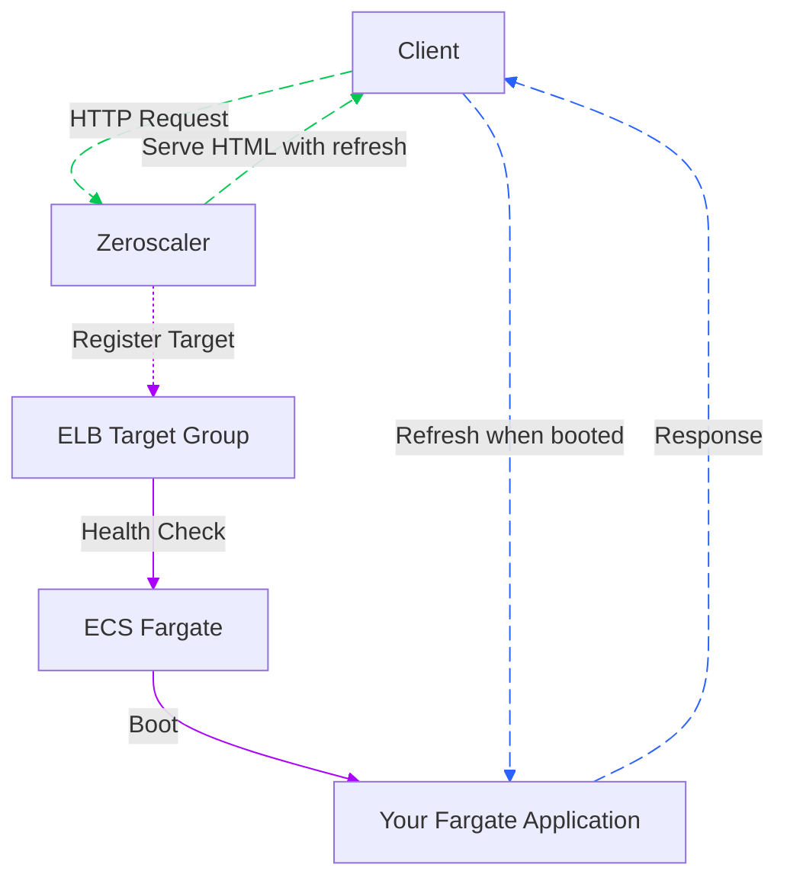

# Zeroscaler CDK TypeScript Construct Library project

[](https://badge.fury.io/js/@zeroscaler%2Fzeroscaler-cdk)
[](https://badge.fury.io/py/zeroscaler)
[](https://badge.fury.io/nu/ZeroScalerCDK)
[](https://pkg.go.dev/github.com/lephyrius/zeroscaler/zeroscaler)
[](https://www.typescriptlang.org/)
[](https://aws.amazon.com/cdk/)
[](http://makeapullrequest.com)
[](https://opensource.org/licenses/MPL-2.0)

*The Zeroscaler construct* deploys a Lambda function that automatically starts your Fargate application in response to incoming requests. It also handles health monitoring and integrates with an ELB target group.

You can configure the construct using the (`ZeroscalerProps`) interface, which requires a target group ARN and Fargate task ARN. Optionally, you can also specify a custom VPC and ECS cluster.

## Useful commands

* `npm run build`   compile typescript to js
* `npm run watch`   watch for changes and compile
* `npm run test`    perform the jest unit tests

## Diagram of the Construct



## Installation

```bash
npm install @zeroscaler/zeroscaler-cdk
```

## Usage

```python
import * as cdk from 'aws-cdk-lib';
import { Construct } from 'constructs';
import { ZeroScaler } from '@zeroscaler/zeroscaler-cdk';

new Zeroscaler(stack, 'MyZeroscaler', {
    targetGroupArn: 'arn:aws:elasticloadbalancing:...',
    fargateTaskArn: 'arn:aws:ecs:...',
    // Optionally override vpc or cluster
    });
```

## License

MPL-2.0
